# Azure Policy: Restricting Resource Deployments by Region

## Overview

In this lab, I configured and assigned an Azure Policy that restricts where Azure resources can be deployed. The goal was to enforce organizational governance by allowing deployments only in approved Azure regions.

To validate the policy, I attempted to deploy a Virtual Network in an unauthorized region (Norway East), which Azure correctly denied. I then deployed the same resource in an approved region, where the deployment completed successfully.

This lab demonstrates how Azure Policy can enforce compliance across an Azure environment without requiring manual oversight.

---

## Technologies Used

- Microsoft Azure
- Azure Policy
- Azure Resource Groups
- Azure Virtual Networks
- Azure Governance
- Azure Resource Manager (ARM)

---

## Skills Demonstrated

- Creating Azure Policy assignments
- Working with built-in Azure Policies
- Restricting Azure resource deployment locations
- Assigning policies to Resource Groups
- Understanding policy scopes
- Testing Azure Policy enforcement
- Validating compliance through deployment testing
- Azure Governance fundamentals

---

# Lab Walkthrough

## Step 1 – Navigate to Azure Policy Definitions

From the Azure portal, I opened **Azure Policy** and selected **Definitions**. Azure provides hundreds of built-in policy definitions that organizations can use to enforce governance, compliance, security, and operational standards.

At this stage, I reviewed the available built-in policies before selecting the one needed for this lab.

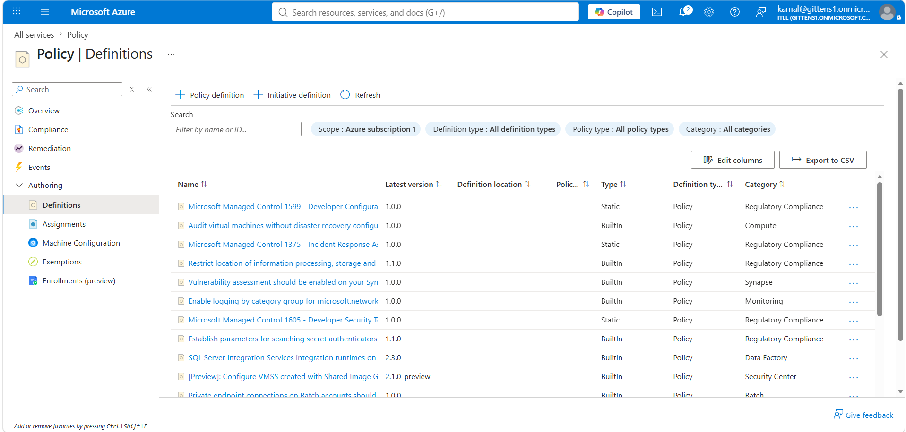

---

## Step 2 – Locate the "Allowed locations" Policy

Using the search bar, I searched for the built-in policy named **Allowed locations**.

This policy restricts where Azure resources may be deployed by allowing administrators to specify approved Azure regions.

This is commonly used to:

- Meet regulatory compliance
- Reduce latency
- Keep workloads in approved geographic regions
- Prevent accidental deployments worldwide

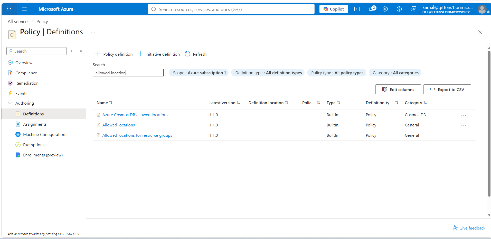

---

## Step 3 – Review the Policy Definition

Before assigning the policy, I reviewed Microsoft's built-in policy definition.

The policy uses Azure Policy parameters to allow administrators to specify:

- Approved Azure regions
- Enforcement effect
- Assignment scope

Understanding the policy definition helps explain how Azure evaluates resources before deployment.

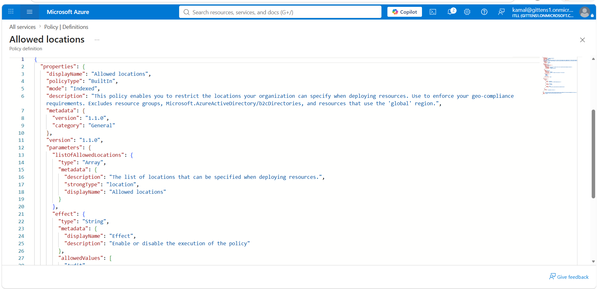

---

## Step 4 – Assign the Policy

Next, I created a new policy assignment.

The assignment determines **where** the policy will be enforced.

For this lab, I assigned the policy to my Resource Group.

Policy Scope:

- Subscription: Azure Subscription 1
- Resource Group: firstresourcegroup

By assigning the policy at the Resource Group level, every resource deployed inside that Resource Group must comply with the policy.

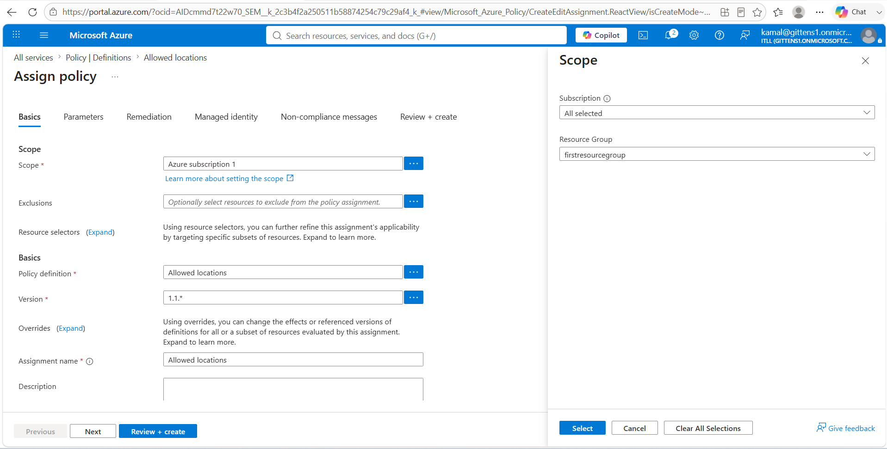

---

## Step 5 – Configure Allowed Azure Regions

During policy assignment, I configured the list of approved Azure regions.

For this lab, I allowed only the following regions:

- East US
- East US 2
- West US

Any attempt to deploy resources outside these approved regions should be denied automatically by Azure Policy.

This demonstrates how administrators can enforce regional deployment standards across an Azure environment.

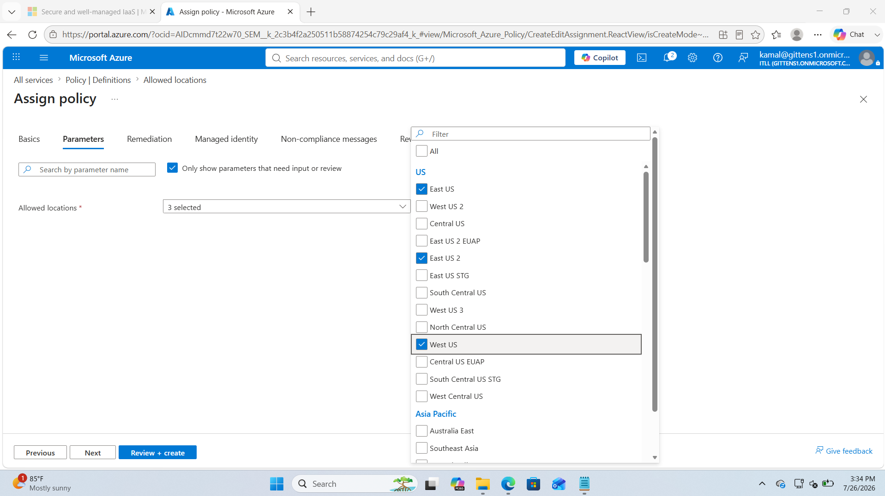

---

## Step 6 – Complete the Policy Assignment

After reviewing the configuration, I created the policy assignment.

Azure successfully applied the policy to the Resource Group.

From this point forward, Azure evaluates every deployment against the policy before allowing resource creation.

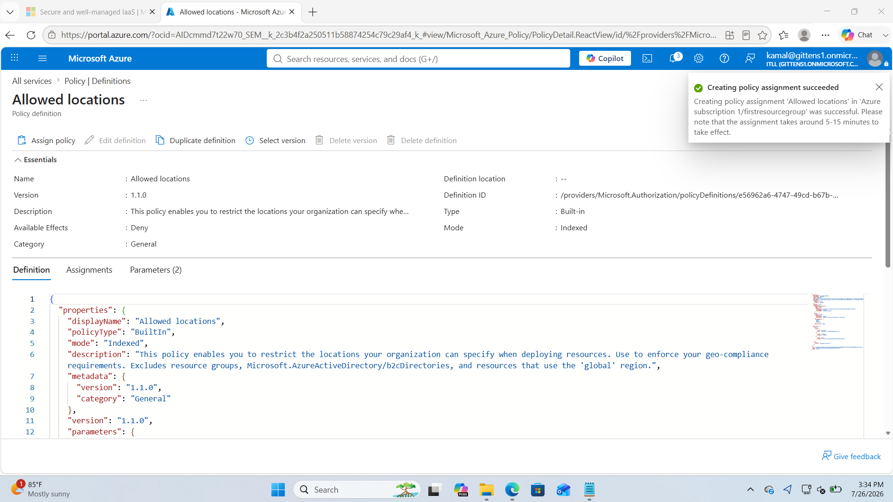

---

## Step 7 – Verify the Assignment

I verified that the new policy assignment appeared under **Azure Policy → Assignments**.

This confirms that the policy is actively protecting the selected Resource Group.

Any future deployments inside this Resource Group will now be evaluated against the allowed locations policy.

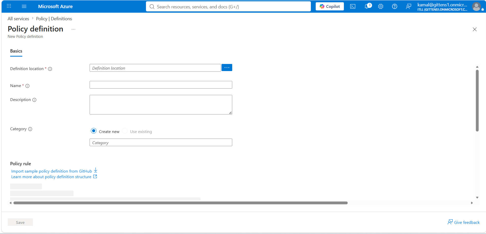

---

# Testing Policy Enforcement

The next steps validate that the Azure Policy is functioning correctly.

---

## Step 8 – Attempt Deployment in a Blocked Region

To verify enforcement, I attempted to deploy a new Azure Virtual Network.

Instead of selecting one of the approved regions, I intentionally chose:

**Norway East**

Since Norway East was **not included** in the allowed locations policy, Azure should reject the deployment.

This is the expected behavior because Azure Policy evaluates requests before resources are created.

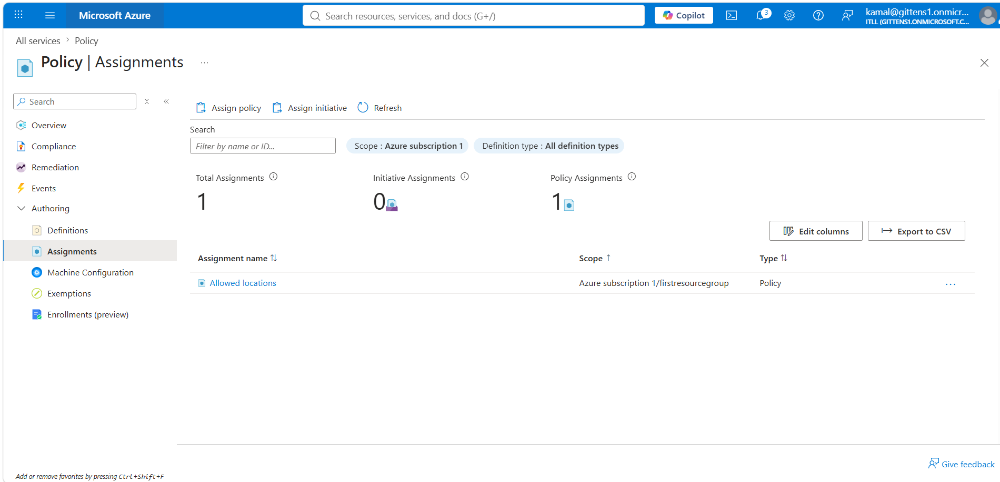

---

## Step 9 – Deployment Blocked by Azure Policy

As expected, Azure prevented the deployment.

The deployment failed because Norway East is not one of the approved locations defined in the Azure Policy assignment.

This confirms that Azure Policy is actively enforcing governance and preventing non-compliant resource deployments.

Instead of relying on administrators to manually review deployments, Azure automatically blocks violations.

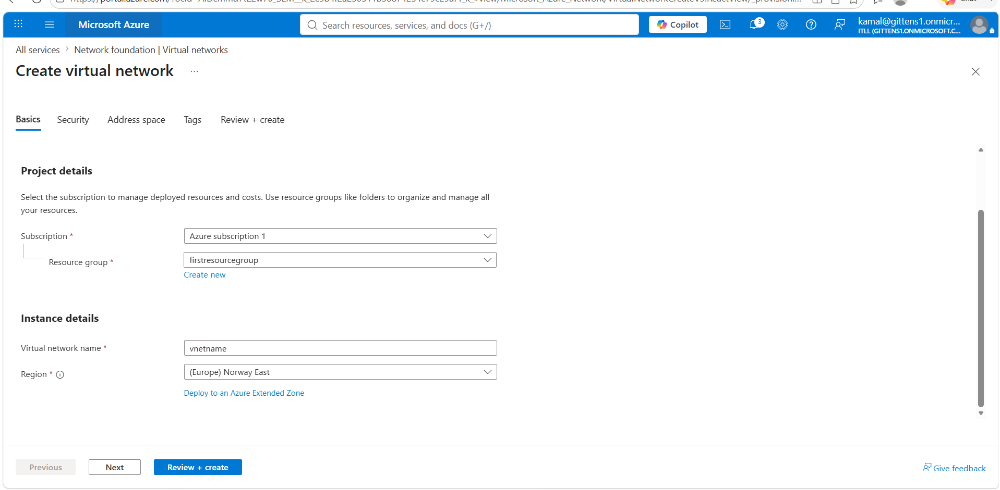

---

## Step 10 – Deploy in an Approved Region

To verify the policy worked correctly, I repeated the deployment using one of the approved Azure regions specified in the policy.

Because the selected region complied with the policy, Azure allowed the deployment to continue.

This demonstrates that Azure Policy blocks only non-compliant deployments while allowing approved deployments without additional administrator intervention.

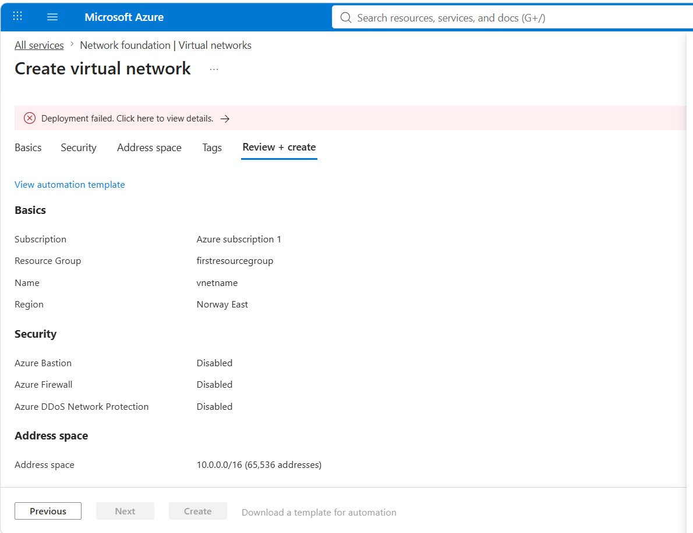

---

## Step 11 – Successful Deployment

The Virtual Network deployed successfully.

This confirms that:

- The Azure Policy assignment is functioning correctly.
- Unauthorized regions are automatically denied.
- Approved regions continue to deploy normally.

This type of governance helps organizations maintain compliance while reducing administrative overhead and preventing accidental resource deployments outside approved locations.

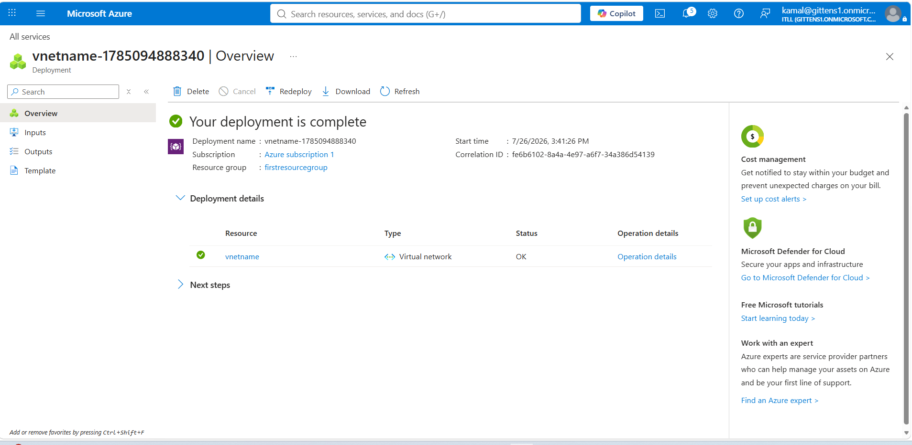

---

# What I Learned

This lab reinforced several important Azure governance concepts:

- Azure Policy evaluates resources before deployment.
- Policies can be assigned at different scopes, including Management Groups, Subscriptions, and Resource Groups.
- Built-in Azure Policies simplify governance without requiring custom policy development.
- Policy assignments help enforce organizational standards automatically.
- Restricting deployment regions is an effective method for improving compliance, governance, and operational consistency.
- Azure Policy works alongside Azure RBAC to provide both access control and governance within Azure environments.

---

# Key Takeaways

✔ Created and assigned an Azure Policy

✔ Configured approved Azure deployment regions

✔ Applied governance at the Resource Group scope

✔ Validated policy enforcement using a blocked deployment

✔ Successfully deployed resources after meeting policy requirements

✔ Gained hands-on experience with Azure Governance and Compliance
