# Azure Blob Storage Security with Containers, SAS Tokens, and RBAC

## Overview

This project demonstrates how I secured Azure Blob Storage using multiple Azure security features. I created a private storage container, verified that anonymous access was blocked, rotated storage account access keys, generated Shared Access Signature (SAS) tokens, configured Stored Access Policies, and implemented Azure Role-Based Access Control (RBAC) for secure authentication.

The project illustrates several Azure security best practices including least privilege, temporary delegated access through SAS tokens, access key rotation, and Microsoft Entra ID authorization.

---

## Technologies Used

- Microsoft Azure
- Azure Blob Storage
- Storage Accounts
- Blob Containers
- Shared Access Signature (SAS)
- Stored Access Policies
- Azure RBAC
- Microsoft Entra ID
- Access Keys
- Azure Portal

---

## Skills Demonstrated

- Creating Blob Containers
- Configuring private storage
- Understanding anonymous access
- Troubleshooting storage authentication
- Rotating Storage Account Keys
- Generating SAS Tokens
- Creating Stored Access Policies
- Assigning Azure RBAC roles
- Blob security best practices
- Azure Storage administration

---

# Lab Walkthrough

## Step 1 – Create a Private Blob Container

I opened my Storage Account and navigated to **Containers**.

I created a new Blob Container named:

`firstcontainer`

The access level was configured as:

**Private (No anonymous access)**

Azure automatically restricted public access because anonymous access was disabled for the storage account.

### Screenshot

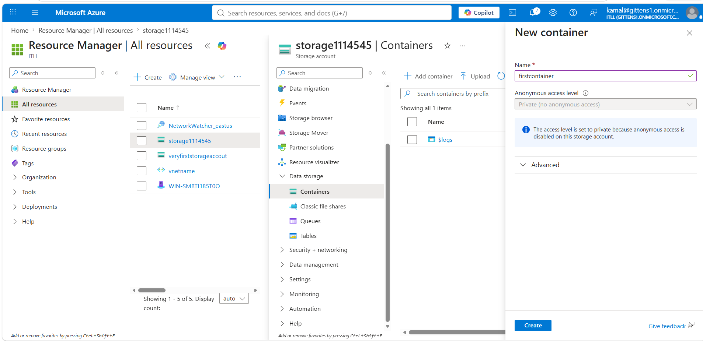

---

## Step 2 – Verify the New Container

After creating the container, I confirmed that Azure successfully created the container.

The new container appeared inside the Storage Account and was ready for storing blobs.

### Screenshot

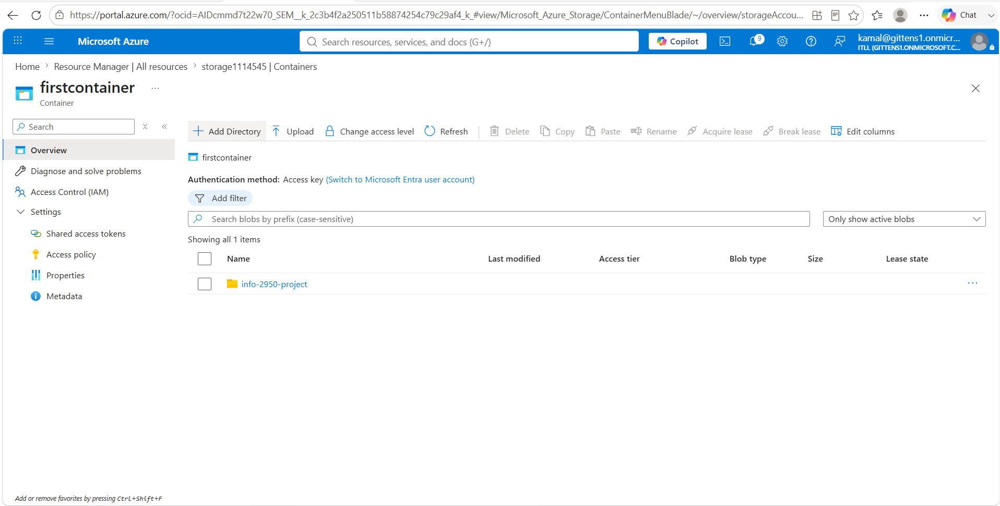

---

## Step 3 – Test Anonymous Access

I attempted to browse directly to the Blob Container URL.

Azure returned:

```
PublicAccessNotPermitted
```

This verified that the container could not be accessed anonymously.

### Screenshot

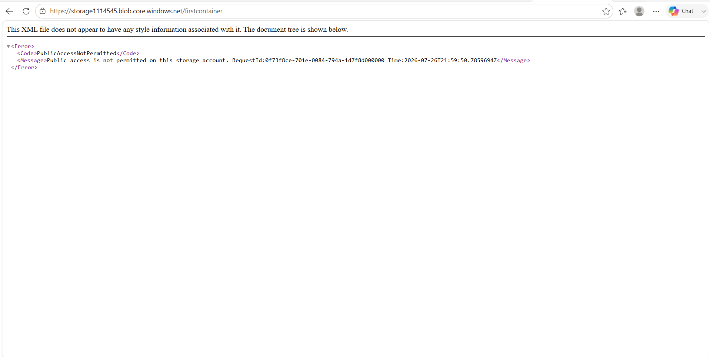

---

## Step 4 – Review Storage Account Access Keys

Next, I opened the Storage Account's **Access Keys** section.

Azure provides two storage account keys that can authenticate requests made to Blob Storage.

These keys allow applications to authenticate without requiring Microsoft Entra ID.

### Screenshot

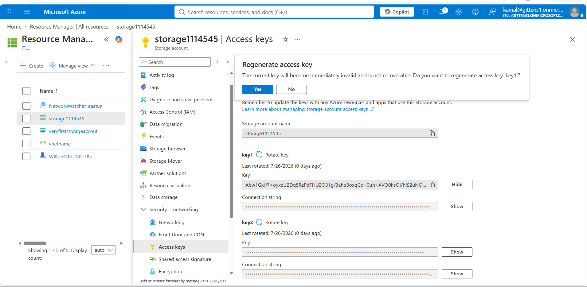

---

## Step 5 – Rotate the Primary Access Key

I regenerated **Key1**.

Rotating storage account keys is a security best practice because it invalidates compromised credentials while allowing applications to transition to another key.

### Screenshot

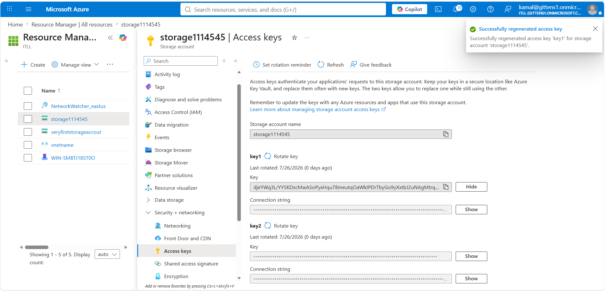

---

## Step 6 – Verify Key Rotation

Azure successfully regenerated the storage account access key.

The newly generated key replaced the previous credential.

### Screenshot

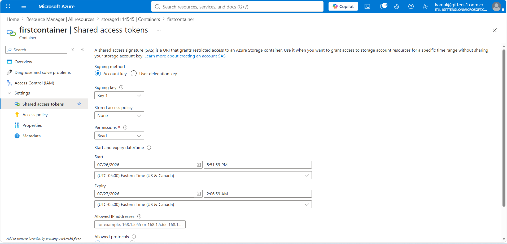

---

## Step 7 – Configure Shared Access Signature (SAS)

I opened **Shared Access Tokens** for the Blob Container.

I selected:

- Account Key authentication
- Read permission
- Start time
- Expiration time
- HTTPS only

This configuration limits access to only what is required.

### Screenshot

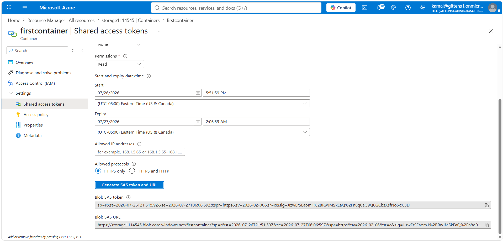

---

## Step 8 – Generate the SAS Token

Azure generated:

- Blob SAS Token
- Blob SAS URL

These allow temporary delegated access without exposing the Storage Account Key.

### Screenshot

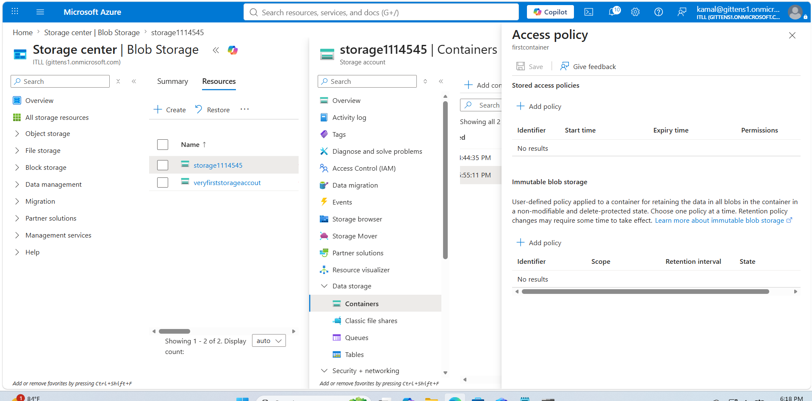

---

## Step 9 – Review Container Access Policy

I opened the container's **Access Policy** settings.

Initially no Stored Access Policies were configured.

### Screenshot

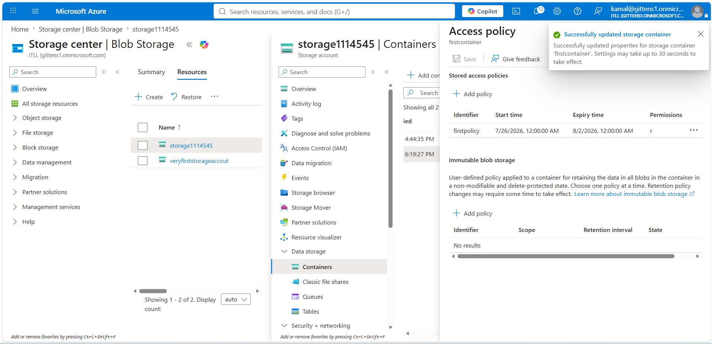

---

## Step 10 – Create a Stored Access Policy

I configured a Stored Access Policy named:

`firstpolicy`

The policy defined:

- Read permission
- Start date
- Expiration date

Stored Access Policies make SAS tokens easier to manage because permissions can later be modified without regenerating every SAS token.

### Screenshot

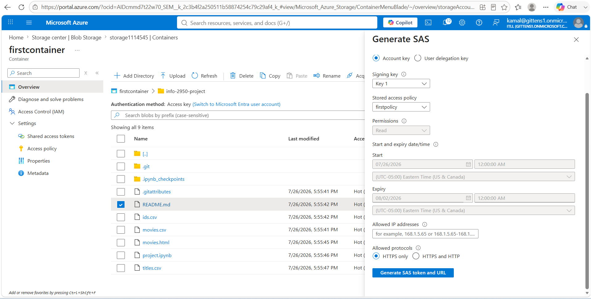

---

## Step 11 – Verify the SAS URL

Using the generated SAS URL, I successfully accessed the blob.

Unlike anonymous access, the SAS token authenticated the request.

### Screenshot

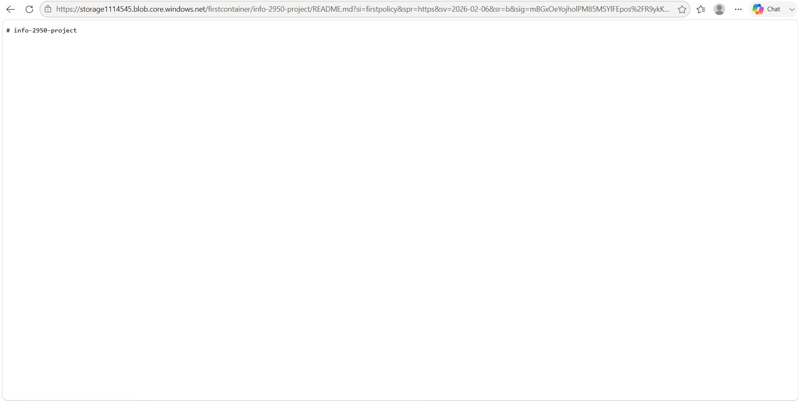

---

## Step 12 – Edit the Stored Access Policy

I modified the Stored Access Policy settings.

Azure allows administrators to update expiration dates and permissions for existing policies.

### Screenshot

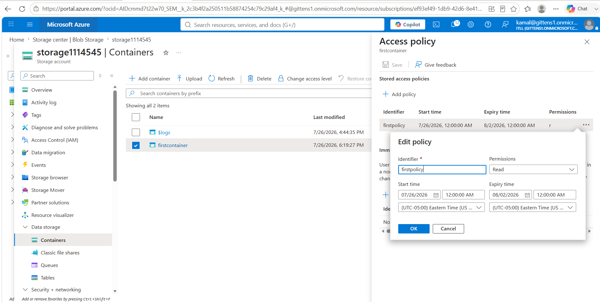

---

## Step 13 – Save the Updated Policy

Azure successfully saved the updated Stored Access Policy.

Future SAS tokens referencing this policy automatically inherit the updated permissions.

### Screenshot

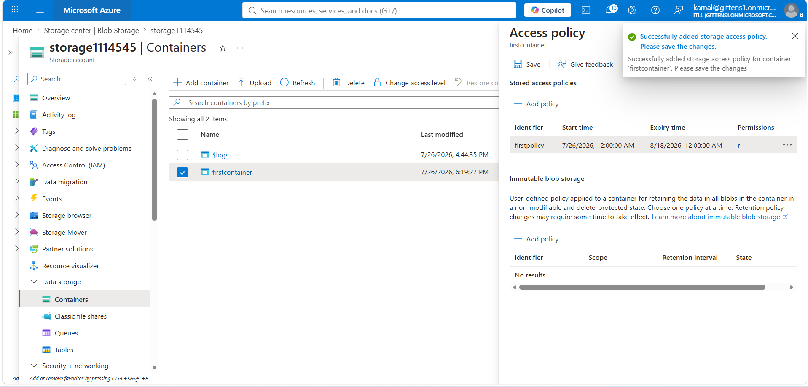

---

## Step 14 – Review Storage Account Security Configuration

I reviewed the Storage Account Configuration settings.

Important security settings included:

- Secure Transfer Required
- IPv4 connectivity
- Blob Anonymous Access
- Storage Account Key Access

### Screenshot

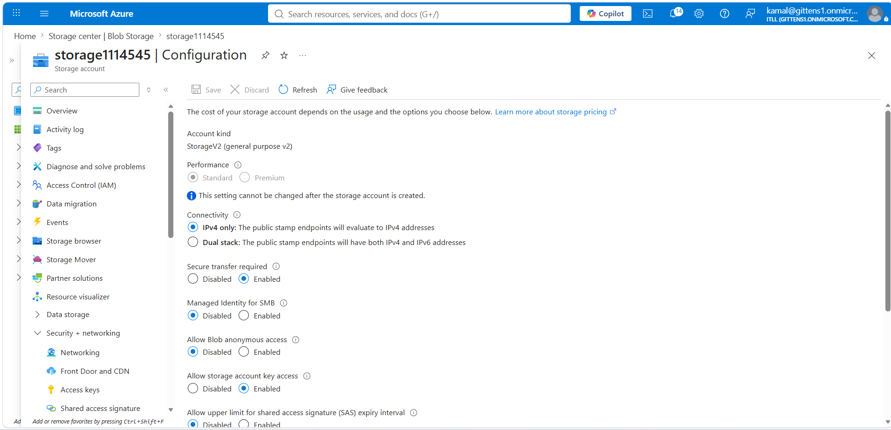

---

## Step 15 – Disable Storage Account Key Authentication

I disabled:

**Allow Storage Account Key Access**

Disabling Shared Key authentication forces clients to authenticate using Microsoft Entra ID instead of long-lived storage account keys.

### Screenshot

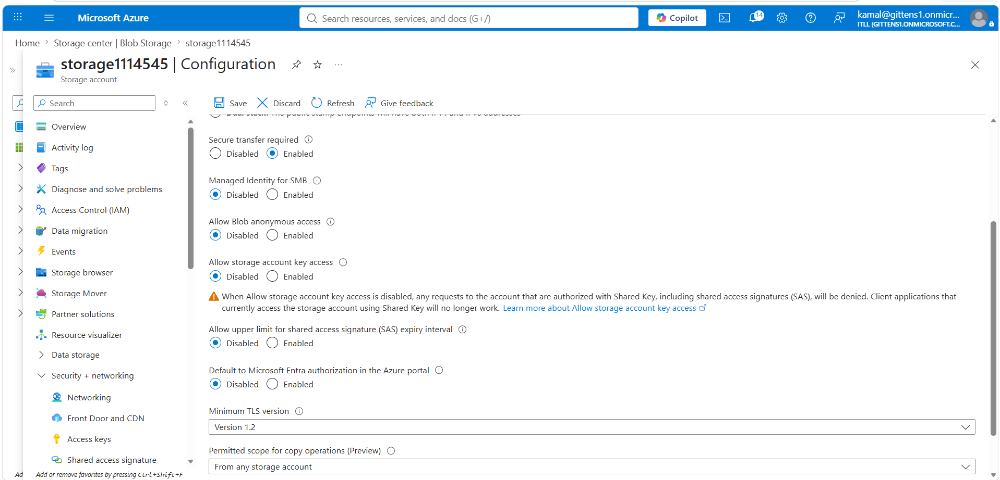

---

## Step 16 – Observe Authentication Failure

After disabling Storage Account Key authentication, Azure displayed an authentication error.

This confirmed that key-based authentication was no longer accepted.

### Screenshot

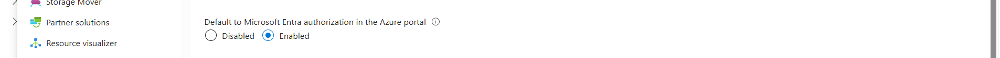

---

## Step 17 – Configure Azure RBAC

To restore secure access, I opened:

**Access Control (IAM)**

I selected the built-in Azure role:

**Storage Blob Data Contributor**

### Screenshot

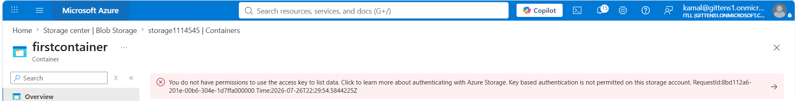

---

## Step 18 – Assign RBAC Permissions

I assigned the Storage Blob Data Contributor role to my Microsoft Entra account.

Azure confirmed the role assignment.

### Screenshot

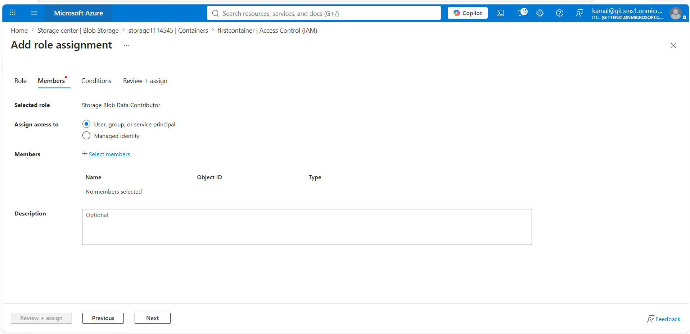

---

## Step 19 – Verify Azure RBAC

Finally, I verified the completed role assignments.

The container now used Azure RBAC instead of Shared Key authentication, providing more secure identity-based authorization.

### Screenshot

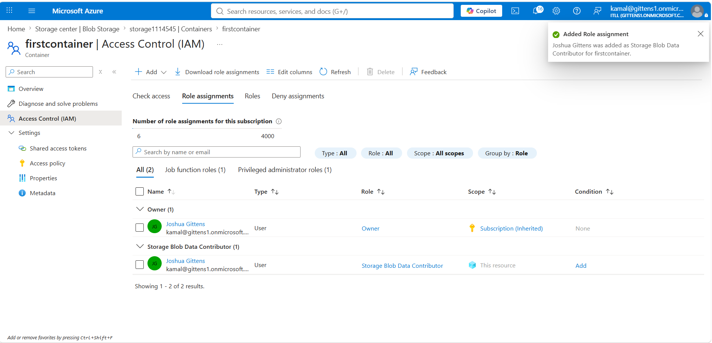

---

# Validation

This project successfully demonstrated:

- Creating Azure Blob Containers
- Configuring private storage
- Preventing anonymous access
- Rotating storage account keys
- Generating SAS tokens
- Configuring Stored Access Policies
- Updating SAS policies
- Disabling Shared Key authentication
- Implementing Microsoft Entra authentication
- Assigning Azure RBAC permissions

---

# What I Learned

This project provided hands-on experience securing Azure Blob Storage using multiple layers of access control. I learned how private containers prevent anonymous access, how SAS tokens provide time-limited delegated permissions, and how Stored Access Policies simplify long-term management of SAS tokens.

I also practiced rotating storage account keys and observed how disabling Shared Key authentication forces clients to use Microsoft Entra ID and Azure RBAC. This demonstrated Microsoft's recommended identity-first security model for Azure Storage.

---

# Key Takeaways

- Blob Containers should remain private unless public access is required.
- SAS Tokens provide temporary delegated access without exposing storage account keys.
- Stored Access Policies simplify SAS token management.
- Rotating access keys reduces the risk of credential compromise.
- Microsoft recommends Microsoft Entra ID authentication over Shared Key authentication.
- Azure RBAC enables least-privilege access using built-in roles such as Storage Blob Data Contributor.
- Combining private containers, SAS tokens, RBAC, and key rotation provides layered security for Azure Blob Storage.
