# Azure Storage: Switching from Storage Account Keys to Microsoft Entra ID RBAC

## Overview

This project demonstrates how I secured an Azure Storage Account by replacing traditional Shared Key authentication with **Microsoft Entra ID** and **Azure Role-Based Access Control (RBAC)**.

Instead of relying on storage account keys that grant broad access, I configured identity-based authorization using Azure RBAC. I assigned permissions at both the storage account and blob container levels and validated access using Microsoft Entra user accounts.

This lab demonstrates Azure identity and access management concepts that are commonly used by Azure Administrators, Cloud Engineers, Infrastructure Engineers, and Security Engineers.

---

# Objectives

The primary objectives of this project were to:

- Deploy an Azure Storage Account
- Configure storage security settings
- Understand Shared Key authentication
- Configure Microsoft Entra authentication
- Disable Shared Key authorization
- Assign Azure RBAC roles
- Configure container-level permissions
- Validate blob access using Microsoft Entra identities
- Demonstrate least privilege access

---

# Technologies Used

- Microsoft Azure
- Azure Storage Accounts
- Azure Blob Storage
- Microsoft Entra ID
- Azure Role-Based Access Control (RBAC)
- Access Control (IAM)
- Storage Blob Data Owner
- Storage Blob Data Reader
- Storage Blob Data Contributor
- Azure Resource Groups
- TLS 1.2
- Azure Portal

---

# Skills Demonstrated

- Azure Administration
- Azure Storage
- Identity and Access Management (IAM)
- Azure RBAC
- Microsoft Entra ID
- Cloud Security
- Blob Storage Administration
- Least Privilege Access
- Storage Security
- Resource Authorization
- Container-Level Permissions
- Access Reviews
- Azure Portal Administration

---

# Why Replace Storage Account Keys?

Azure Storage Accounts include two access keys.

These keys allow anyone possessing them to authenticate directly to the storage account.

Although simple, Shared Key authentication has several disadvantages.

## Shared Key Authentication

Advantages

- Simple to configure
- Works with older applications
- Supports scripts using connection strings

Disadvantages

- Full storage account access
- Keys are shared among users
- Difficult auditing
- Manual key rotation
- Keys may be accidentally exposed
- No identity-based authorization
- Cannot enforce least privilege

---

## Microsoft Entra ID + Azure RBAC

Using Microsoft Entra authentication provides significantly better security.

Advantages

- Identity-based authentication
- Individual user permissions
- Supports MFA
- Supports Conditional Access
- Easy role removal
- Detailed auditing
- Least privilege access
- Role inheritance

---

# Azure RBAC Architecture

```text
Microsoft Entra ID
        │
        │ Authentication
        ▼
Azure RBAC
        │
        ▼
Azure Storage Account
        │
        ├───────────────┐
        │               │
        ▼               ▼
Container 1        Container 2
        │               │
        ▼               ▼
Blob Files       Blob Files
```

---

# Management Plane vs Data Plane

Azure Storage uses two permission models.

## Management Plane

Management plane permissions control the Azure resource itself.

Examples include:

- Owner
- Contributor
- Reader

These roles allow administrators to:

- Create storage accounts
- Delete storage accounts
- Configure networking
- Configure encryption
- Configure access policies

Management plane roles DO NOT automatically grant access to blob data.

---

## Data Plane

Data plane permissions control the actual files stored inside Azure Storage.

Examples include:

- Storage Blob Data Owner
- Storage Blob Data Contributor
- Storage Blob Data Reader

These roles determine whether a user can:

- Read blobs
- Upload blobs
- Delete blobs
- Modify blob metadata

This separation is one of Azure Storage's most important security concepts.

---

# Azure RBAC Scope

Azure RBAC permissions can be assigned at different scopes.

```text
Management Group

        │

Subscription

        │

Resource Group

        │

Storage Account

        │

Blob Container

        │

Blob
```

Permissions assigned higher in the hierarchy are inherited by lower resources unless explicitly overridden.

---

# Project Walkthrough

## Step 1 — Create an Azure Storage Account

The first step was creating a new Azure Storage Account.

Configuration included:

- Standard Performance
- StorageV2
- East US Region
- Locally Redundant Storage (LRS)

This storage account serves as the parent resource for all blob containers.

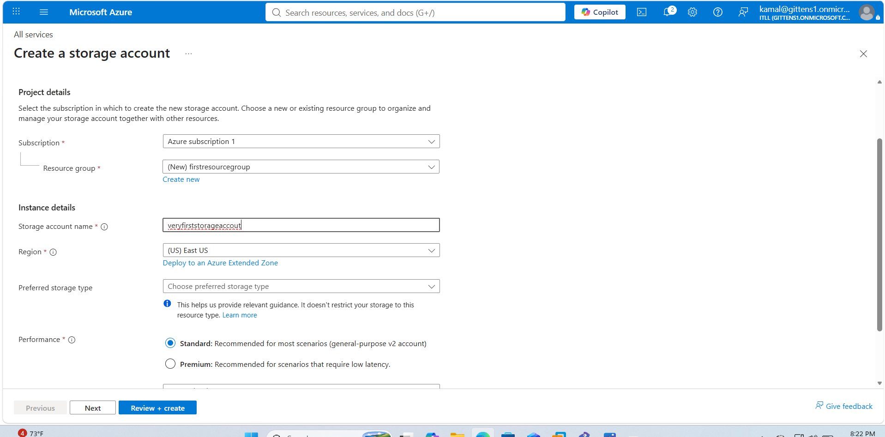

---

## Step 2 — Configure Advanced Storage Settings

During deployment I reviewed several advanced storage options including:

- Hierarchical Namespace
- Secure File Transfer Protocol (SFTP)
- NFS v3
- Cross-Tenant Replication
- Blob Access Tier

For this lab I left Hierarchical Namespace disabled because the project focused on Azure Blob Storage rather than Azure Data Lake Storage Gen2.

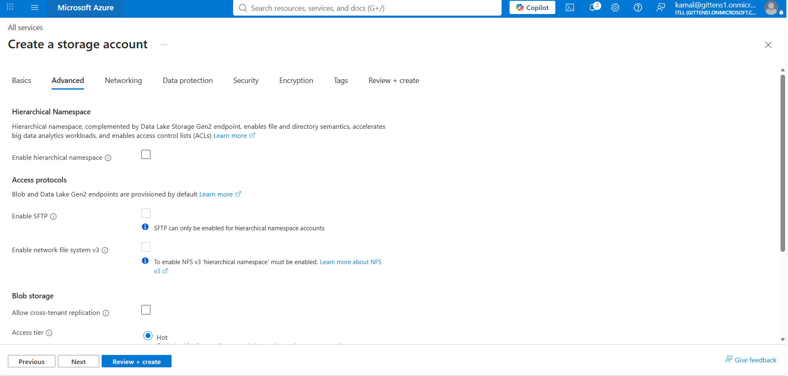

---

## Step 3 — Deploy the Storage Account

After validating the configuration Azure deployed the storage account into the selected resource group.

Deployment included:

- Azure Subscription
- Resource Group
- Storage Account
- Default Storage Configuration

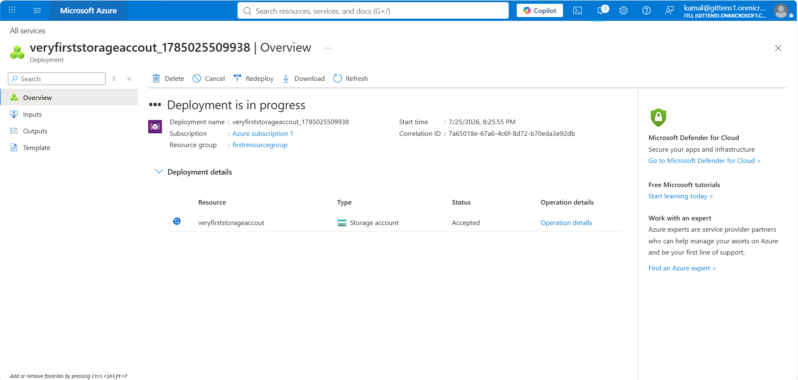

---

## Step 4 — Verify Deployment

Once deployment completed successfully I reviewed the storage account properties.

Important configuration included:

- Secure Transfer Enabled
- TLS 1.2
- StorageV2
- Standard Performance
- LRS Replication
- Blob Anonymous Access Disabled

These settings provide a secure baseline for Azure Storage.

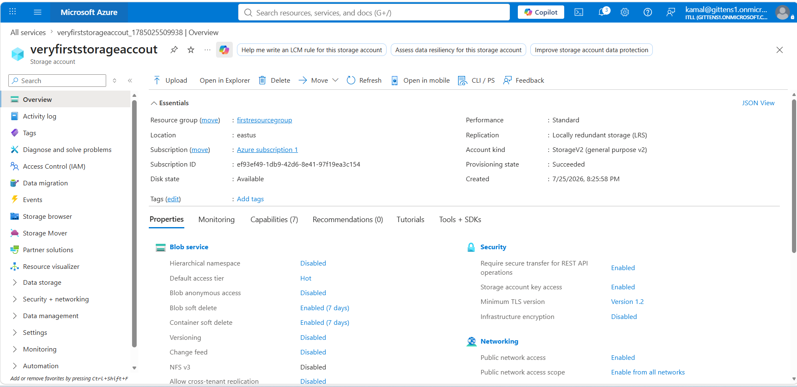

---

## Step 5 — Review Storage Account Keys

Azure automatically creates two Storage Account Keys.

These keys can authenticate directly against the storage account without requiring Microsoft Entra authentication.

This authentication method is called **Shared Key Authentication**.

Although functional, Microsoft recommends migrating away from Shared Keys whenever possible.

Reasons include:

- Shared secrets
- Difficult auditing
- No identity association
- Broad permissions

The storage account keys remained hidden throughout this project to protect credentials.

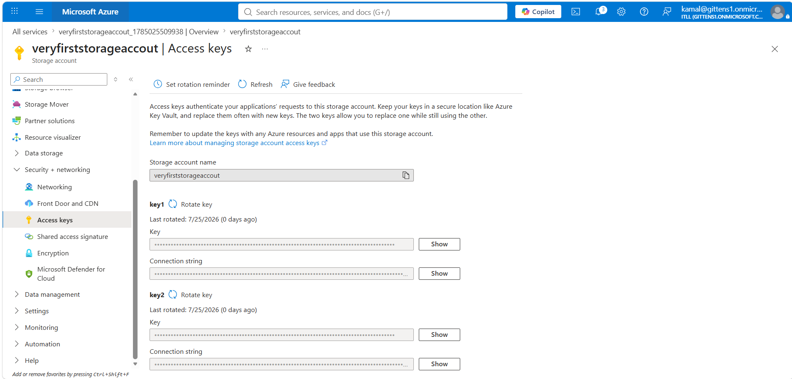

---

## Step 6 — Configure Storage Account Security

Next I reviewed the Storage Account Configuration page.

Security settings included:

- Secure Transfer Required
- Blob Anonymous Access Disabled
- Microsoft Entra Authorization Enabled
- Minimum TLS Version 1.2
- Hot Blob Access Tier

Enabling Microsoft Entra Authorization causes Azure Portal authentication to rely on Microsoft Entra identities rather than Storage Account Keys.

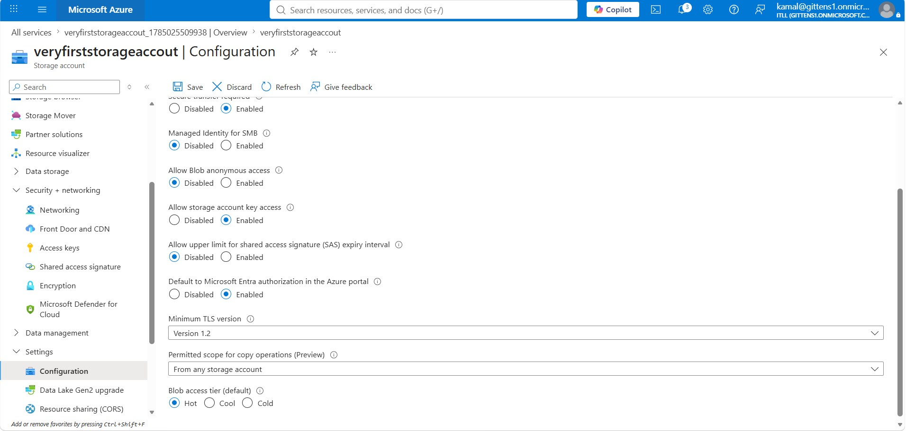

---

## Step 7 — Disable Shared Key Authentication

One of the primary goals of this project was to eliminate dependency on Shared Key authentication.

Azure Storage allows administrators to disable Storage Account Key access.

After opening the **Configuration** blade of the storage account, I reviewed the following security settings:

- Secure transfer required
- Blob anonymous access
- Storage account key access
- Microsoft Entra authorization
- TLS version

The critical change was disabling:

**Allow storage account key access**

Disabling this setting prevents users and applications from authenticating with:

- Storage account keys
- Connection strings using Shared Key
- Shared Key authorization

Instead, authentication must occur using Microsoft Entra identities and Azure RBAC.

This greatly improves security because permissions become tied to an individual identity instead of a shared secret.

Benefits include:

- Better auditing
- Easier access removal
- Support for Conditional Access
- Support for MFA
- Least privilege permissions

> **Note:** Before disabling Shared Key access in production, all applications should first be migrated to Microsoft Entra authentication or Managed Identities.

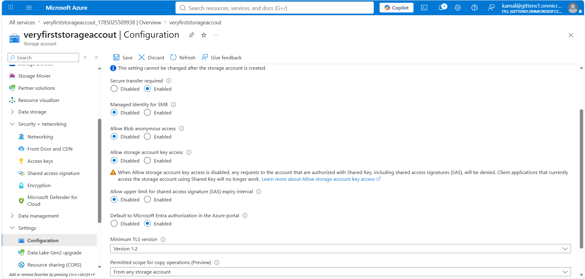

---

## Step 8 — Access Control (IAM)

After securing the storage account, I opened **Access Control (IAM)**.

IAM is Azure's centralized authorization system that controls who can perform actions on Azure resources.

The IAM blade provides several important capabilities:

- Review existing role assignments
- Assign Azure roles
- Check user access
- View inherited permissions
- Review deny assignments

Access Control follows Azure RBAC principles by assigning permissions to identities instead of sharing credentials.

This is the foundation of Microsoft's Zero Trust model.

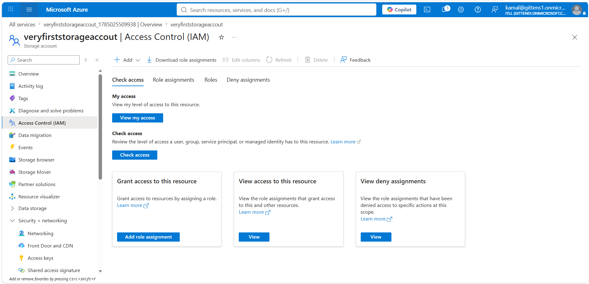

---

# Understanding Azure RBAC

Azure Role-Based Access Control (RBAC) is Microsoft's authorization service.

Authentication answers:

> Who are you?

Authorization answers:

> What are you allowed to do?

Azure RBAC answers the second question.

Permissions are granted through:

- Users
- Groups
- Service Principals
- Managed Identities

Rather than assigning permissions directly to resources.

---

# Principle of Least Privilege

This project follows Microsoft's recommended security practice:

**Grant only the permissions necessary for the task.**

For example:

A user that only needs to download files should receive:

Storage Blob Data Reader

NOT

Storage Blob Data Owner

Likewise,

Someone managing Azure resources may receive:

Contributor

without ever receiving permission to read sensitive storage data.

---

## Step 9 — Review Azure Management Roles

Next I reviewed Azure's built-in management roles.

Three of the most common roles are:

### Owner

The Owner role provides:

- Full resource management
- Role assignment permissions
- Complete administrative control

Owners can create new RBAC assignments.

---

### Contributor

Contributors can:

- Create resources
- Modify resources
- Delete resources

However,

Contributors **cannot assign Azure RBAC roles.**

---

### Reader

Readers can:

- View Azure resources
- Inspect configuration
- Review settings

Readers cannot make changes.

---

These three roles belong to the **Management Plane**.

They control Azure resources—not blob data.

This distinction is extremely important during Azure administration.

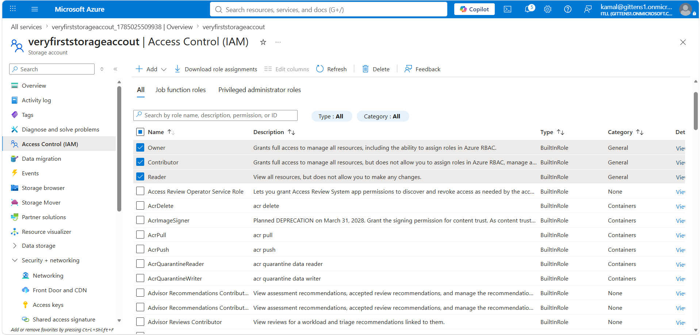

---

# Management Plane Example

Imagine the following scenario.

A user receives:

Owner

for a Storage Account.

That user can:

✔ Configure networking

✔ Configure encryption

✔ Delete the storage account

✔ Configure lifecycle policies

However,

That same user may still receive:

**AuthorizationPermissionMismatch**

when attempting to download a blob.

Why?

Because blob access belongs to the **Data Plane**, which requires Storage Blob Data roles.

---

## Step 10 — Review Storage Blob Data Roles

Next I searched Azure's built-in Storage Blob roles.

These roles provide permissions over the actual files stored inside Azure Blob Storage.

---

### Storage Blob Data Reader

Permissions include:

- View containers
- Download blobs
- Read blob metadata

Cannot:

- Upload
- Delete
- Modify blobs

Ideal for:

- Auditors
- Employees needing document access

---

### Storage Blob Data Contributor

Permissions include:

- Read blobs
- Upload blobs
- Delete blobs
- Modify blob metadata

Cannot:

- Assign permissions

Ideal for:

- Developers
- Applications
- Storage operators

---

### Storage Blob Data Owner

Highest Blob Storage permission.

Allows:

- Full blob access
- Read
- Upload
- Delete
- Modify permissions
- Manage POSIX ACLs

Ideal for:

- Storage Administrators

---

### Storage Blob Delegator

This role allows creation of:

**User Delegation SAS**

instead of Shared Key SAS.

This is Microsoft's preferred method for generating SAS tokens because authentication is tied to Microsoft Entra identities.

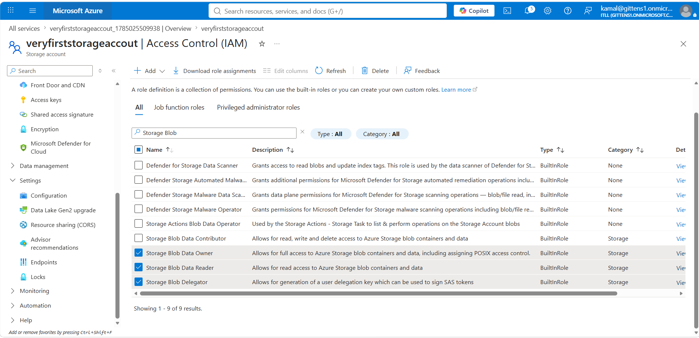

---

# Why Data Roles Matter

Many Azure administrators encounter this situation:

"I can see the Storage Account but I cannot open the blobs."

This happens because Azure separates:

Management permissions

from

Data permissions.

Both must be granted separately.

---

## Step 11 — Assign Storage Blob Data Owner

Next I created a role assignment.

Selected role:

Storage Blob Data Owner

Assigned to:

A Microsoft Entra user

Assignment type:

User

This role assignment grants full blob permissions without sharing Storage Account Keys.

Instead of providing one secret to everyone,

Azure now evaluates:

Identity

↓

Role Assignment

↓

Scope

↓

Authorization Decision

This approach significantly improves cloud security.

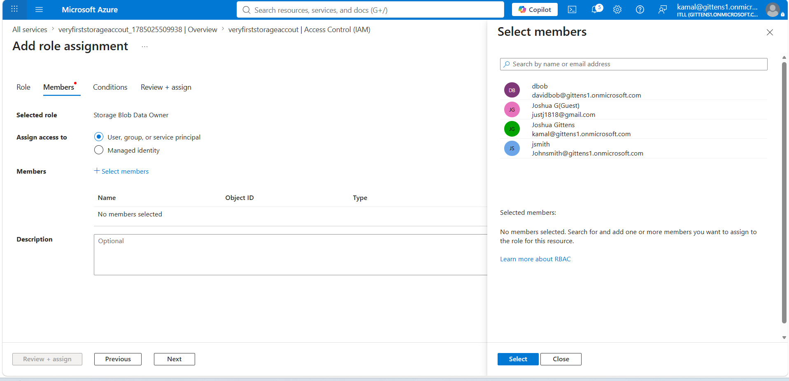

---

# Azure Authorization Flow

```text
Microsoft Entra User

        │

Authenticate

        ▼

Microsoft Entra ID

        │

RBAC Evaluation

        ▼

Storage Blob Data Owner

        │

Permission Granted

        ▼

Blob Container

        │

Blob Files
```

---

## Step 12 — Validate Effective Permissions

Finally,

I validated the user's effective permissions.

Azure displayed two important assignments.

### Inherited Role

Owner

Inherited from the Azure Subscription.

This allows management of Azure resources.

---

### Direct Role Assignment

Storage Blob Data Owner

Assigned directly to the Storage Account.

This grants permission to access blob data.

Azure combines inherited permissions with direct assignments to determine the user's effective access.

Understanding inheritance is critical because permissions can originate from multiple scopes:

- Subscription
- Resource Group
- Storage Account
- Blob Container

This validation confirmed that the user could successfully authenticate using Microsoft Entra ID and perform blob operations without relying on Storage Account Keys.

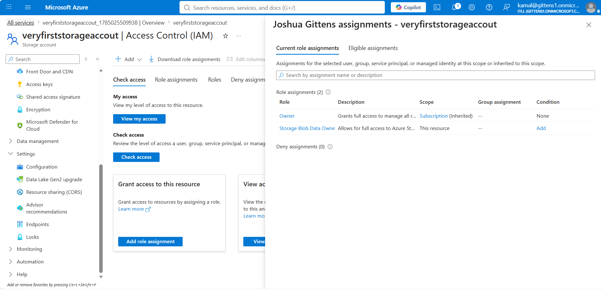

---

# RBAC Summary

During this section of the project I successfully:

- Reviewed Azure management roles
- Reviewed Azure Storage data roles
- Compared Management Plane vs Data Plane permissions
- Disabled Shared Key authentication
- Enabled Microsoft Entra authorization
- Assigned Storage Blob Data Owner
- Verified inherited role assignments
- Verified direct role assignments
- Implemented least privilege authentication
- Replaced shared secrets with identity-based access

The next section demonstrates applying RBAC at the **container level**, creating private containers, assigning Storage Blob Data Reader permissions, and validating Microsoft Entra authentication when uploading and accessing blob data.

# Blob Containers and Container-Level RBAC

After configuring Microsoft Entra authentication and Azure RBAC at the Storage Account level, I continued by creating Blob Containers and assigning permissions directly to individual containers.

Container-level permissions allow administrators to follow the Principle of Least Privilege by granting users access only to the data they require instead of the entire storage account.

---

# Why Container-Level RBAC?

Azure RBAC allows permissions to be assigned at multiple scopes.

Instead of granting a user access to every container within a Storage Account, permissions can be limited to a single container.

Benefits include:

- Reduced attack surface
- Better security isolation
- Easier auditing
- Least privilege access
- Better separation of responsibilities

Example:

Finance Department

↓

Finance Container

Human Resources

↓

HR Container

Engineering

↓

Engineering Container

Each department only receives access to its own container.

---

## Step 13 — Create a Blob Container

Next, I navigated to the **Containers** blade of the Storage Account and created a new Blob Container.

Configuration:

- Container Name: myfirst
- Public Access Level: Private (no anonymous access)

Choosing **Private** ensures that blob data cannot be accessed anonymously over the internet.

Only authenticated Microsoft Entra users with the appropriate Azure RBAC role can access the container.

This aligns with Microsoft's Zero Trust security model.


---

# Why Keep Containers Private?

Azure supports several container access levels.

### Private

Only authenticated users can access blobs.

Recommended for nearly every production environment.

---

### Blob

Anonymous users can read blobs if they know the URL.

Not recommended for sensitive information.

---

### Container

Anonymous users can list the container and access every blob.

Rarely recommended.

For this project I selected **Private** because identity-based authorization is significantly more secure than anonymous access.

---

## Step 14 — Assign Storage Blob Data Reader

After creating the container, I opened **Access Control (IAM)** for the container itself.

Instead of assigning permissions to the Storage Account, I assigned permissions directly to the individual Blob Container.

Role selected:

**Storage Blob Data Reader**

Assigned to:

A Microsoft Entra user.

This role allows the user to:

- View blobs
- Download blobs
- Read metadata

The user cannot:

- Upload blobs
- Delete blobs
- Modify permissions

This demonstrates least privilege because the user receives only the permissions required for reading data.


---

# Why Use Storage Blob Data Reader?

Many users only require read access.

Examples include:

- Executives downloading reports
- Auditors reviewing files
- Employees reading documentation
- Customers downloading invoices

Providing Owner or Contributor permissions would violate the Principle of Least Privilege.

Instead, Storage Blob Data Reader grants exactly the permissions required.

---

## Step 15 — Review Container Role Assignments

After assigning the role, I reviewed the IAM role assignments for the Blob Container.

The results demonstrated Azure RBAC inheritance.

The container displayed inherited permissions from higher scopes as well as direct assignments made specifically to the container.

Inherited Roles included:

- Owner
- Storage Blob Data Owner

Direct Assignment:

- Storage Blob Data Reader

This demonstrates how Azure evaluates permissions across multiple scopes before making an authorization decision.


---

# RBAC Inheritance

Azure RBAC evaluates permissions from the top of the resource hierarchy down to the selected resource.

```text
Subscription
        │
Resource Group
        │
Storage Account
        │
Blob Container
        │
Blob
```

Permissions assigned higher in the hierarchy automatically flow downward.

For example:

Owner assigned at the Subscription

↓

Automatically applies to

Storage Accounts

↓

Blob Containers

↓

Blobs

However, assigning a role directly to a Blob Container limits the permission to only that container.

This provides much better security than assigning broad permissions across an entire subscription.

---

## Step 16 — Upload a Blob Using Microsoft Entra Authentication

Finally, I uploaded a file into the Blob Container.

The Azure Portal authenticated using my Microsoft Entra identity rather than Storage Account Keys.

The portal indicated:

**Authentication Method**

Microsoft Entra user account

This verified that authentication and authorization were being handled through Azure RBAC.

The upload completed successfully without requiring:

- Storage Account Keys
- Shared Key authentication
- Connection strings

Instead, Azure evaluated my Microsoft Entra identity and the assigned RBAC role before permitting access.


---

# Authentication Flow

```text
User

      │

Signs into Azure Portal

      │

Microsoft Entra Authentication

      │

Azure RBAC Evaluation

      │

Storage Blob Data Owner

      │

Access Granted

      │

Blob Container

      │

Upload Blob
```

---

# Storage Account vs Container Permissions

Storage Account Scope

✔ Access to multiple containers

✔ Easier administration

✔ Broader permissions

Container Scope

✔ Access limited to one container

✔ Better isolation

✔ Better security

✔ Least privilege

For organizations with multiple departments, assigning permissions at the container level is generally preferred.

---

# RBAC Roles Used

| Role | Purpose |
|------|---------|
| Owner | Full management of Azure resources including role assignments |
| Contributor | Manage Azure resources without assigning permissions |
| Reader | View Azure resources |
| Storage Blob Data Owner | Full control over blob data |
| Storage Blob Data Contributor | Read, upload, modify, and delete blobs |
| Storage Blob Data Reader | Read-only access to blobs |

---

# Security Improvements Achieved

During this project I successfully replaced Shared Key authentication with Microsoft Entra ID.

Security improvements included:

- Disabled Storage Account Key authentication
- Enabled Microsoft Entra authentication
- Used Azure RBAC
- Assigned least privilege roles
- Eliminated shared credentials
- Implemented identity-based authorization
- Restricted access using container-level RBAC
- Verified inherited permissions
- Verified direct permissions
- Validated Microsoft Entra authentication while accessing blob storage

This approach aligns with Microsoft's cloud security best practices and provides significantly stronger identity management than traditional Storage Account Keys.

# Security Comparison

One of the primary goals of this project was improving the security posture of Azure Storage by replacing Shared Key authentication with Microsoft Entra ID and Azure RBAC.

The following table summarizes the differences.

| Shared Key Authentication | Microsoft Entra ID + Azure RBAC |
|----------------------------|--------------------------------|
| Uses long-lived account keys | Uses Microsoft Entra identities |
| Shared secret | Individual user authentication |
| Difficult auditing | Activity tied to a specific identity |
| Manual key rotation | No storage keys required |
| Broad storage account access | Least privilege access |
| Easy to accidentally expose | Identity-based authorization |
| Does not support Conditional Access | Supports Conditional Access |
| Limited visibility into who accessed data | Full Azure Activity Logs and Sign-In Logs |

---

# Why Microsoft Recommends Microsoft Entra Authentication

Microsoft recommends identity-based authentication whenever possible because it follows Zero Trust principles.

Instead of trusting a shared secret, Azure verifies:

- Who the user is
- What permissions they have
- Where the permissions were assigned
- Whether Conditional Access policies apply
- Whether Multi-Factor Authentication (MFA) has been satisfied

Only after these checks are completed is access granted.

---

# Least Privilege Model

The Principle of Least Privilege means users should receive only the permissions required to perform their job.

Examples include:

### Storage Administrator

Role:

Storage Blob Data Owner

Capabilities:

- Upload blobs
- Delete blobs
- Modify permissions
- Manage ACLs

---

### Application

Role:

Storage Blob Data Contributor

Capabilities:

- Upload files
- Download files
- Delete files

Cannot:

- Change permissions

---

### Auditor

Role:

Storage Blob Data Reader

Capabilities:

- View containers
- Download files
- Read metadata

Cannot:

- Upload
- Delete
- Modify

Using smaller permission scopes significantly reduces security risk.

---

# Role Assignment Best Practices

Microsoft recommends assigning roles to Azure groups whenever possible rather than assigning permissions directly to individual users.

Recommended hierarchy:

```text
User

↓

Microsoft Entra Group

↓

Azure RBAC Role

↓

Azure Resource
```

Benefits include:

- Easier administration
- Simpler onboarding
- Simpler offboarding
- Consistent permissions
- Reduced administrative overhead

---

# Validation Checklist

During this project I successfully completed the following tasks.

## Azure Storage

- Created a Storage Account
- Configured StorageV2
- Used Standard Performance
- Selected Locally Redundant Storage
- Verified successful deployment

---

## Security Configuration

- Enabled Secure Transfer
- Configured TLS 1.2
- Disabled Anonymous Blob Access
- Enabled Microsoft Entra Authorization
- Reviewed Storage Account Keys
- Disabled Shared Key Authentication

---

## Azure RBAC

- Opened Access Control (IAM)
- Reviewed built-in Azure roles
- Compared Management Plane vs Data Plane
- Assigned Storage Blob Data Owner
- Verified inherited permissions
- Verified direct permissions

---

## Blob Containers

- Created private Blob Container
- Assigned Storage Blob Data Reader
- Uploaded blob
- Verified Microsoft Entra authentication
- Confirmed RBAC authorization

---

# Troubleshooting

## Problem

User receives:

AuthorizationPermissionMismatch

Possible causes:

- Missing Storage Blob Data role
- RBAC propagation delay
- Wrong assignment scope

Resolution:

- Verify role assignment
- Wait several minutes
- Sign out and back into Azure
- Refresh Azure Portal
- Verify scope

---

## Problem

User can manage Storage Account but cannot access blobs.

Cause:

Only a Management Plane role is assigned.

Solution:

Assign one of the following:

- Storage Blob Data Reader
- Storage Blob Data Contributor
- Storage Blob Data Owner

---

## Problem

Application stops working after Shared Key authentication is disabled.

Cause:

The application still uses:

- Connection String
- Storage Account Key
- Shared Key Authentication

Resolution:

Migrate to:

- Managed Identity
- Microsoft Entra Authentication
- Service Principal
- User Delegation SAS

---

## Problem

RBAC assignment appears correct but access is denied.

Possible causes:

- Role assigned at incorrect scope
- User signed in with wrong account
- Azure RBAC propagation delay
- Cached authentication token

Resolution:

- Verify effective permissions
- Use Check Access in IAM
- Sign out and back in
- Wait for Azure RBAC propagation

---

# Production Best Practices

When implementing Azure Storage in production environments, Microsoft recommends the following practices.

## Identity

- Use Microsoft Entra ID
- Use Managed Identities whenever possible
- Avoid Shared Keys
- Avoid hardcoded credentials

---

## Authorization

- Follow Least Privilege
- Assign permissions at the lowest scope possible
- Use Microsoft Entra Groups
- Regularly review RBAC assignments

---

## Storage Security

- Disable Anonymous Blob Access
- Require Secure Transfer
- Use TLS 1.2 or higher
- Disable Shared Key authentication whenever applications support identity-based access

---

## Monitoring

Enable:

- Azure Activity Logs
- Diagnostic Settings
- Azure Monitor
- Microsoft Defender for Cloud

Review:

- Failed sign-ins
- Unauthorized access attempts
- Storage Account configuration changes

---

## Credential Management

Avoid storing:

- Storage Account Keys
- Connection Strings
- SAS Tokens

Instead use:

- Azure Key Vault
- Managed Identity
- Microsoft Entra Authentication

---

# What I Learned

This project strengthened my understanding of how Azure separates authentication from authorization.

Authentication determines **who** a user is through Microsoft Entra ID.

Authorization determines **what** that authenticated identity is allowed to do through Azure RBAC.

I also learned that Azure Storage separates Management Plane permissions from Data Plane permissions. A user may have Owner access to a Storage Account yet still require a Storage Blob Data role to interact with blob data.

Finally, I gained hands-on experience implementing identity-based access, assigning RBAC roles at multiple scopes, and validating permissions using Access Control (IAM), reinforcing the importance of least privilege and Microsoft's Zero Trust security model.
