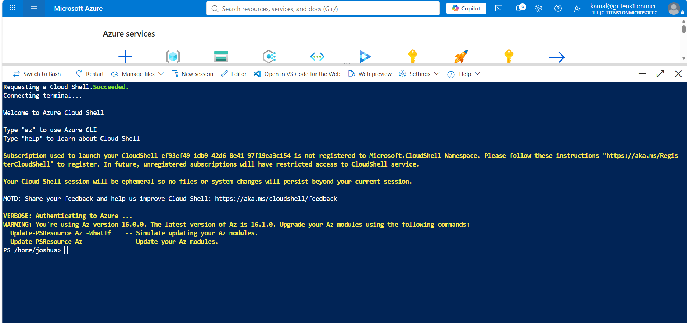
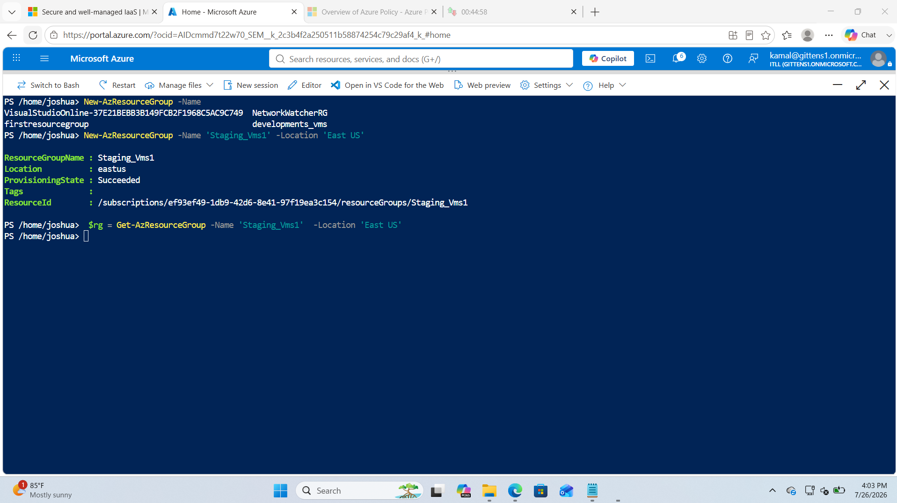
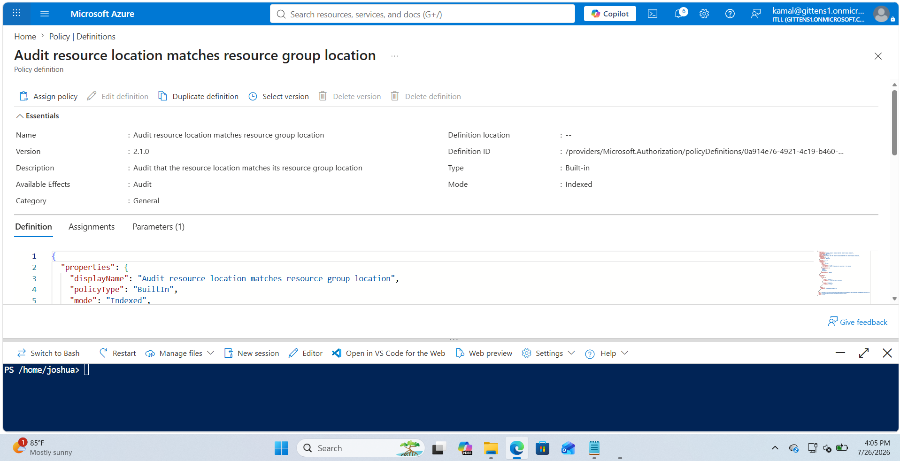
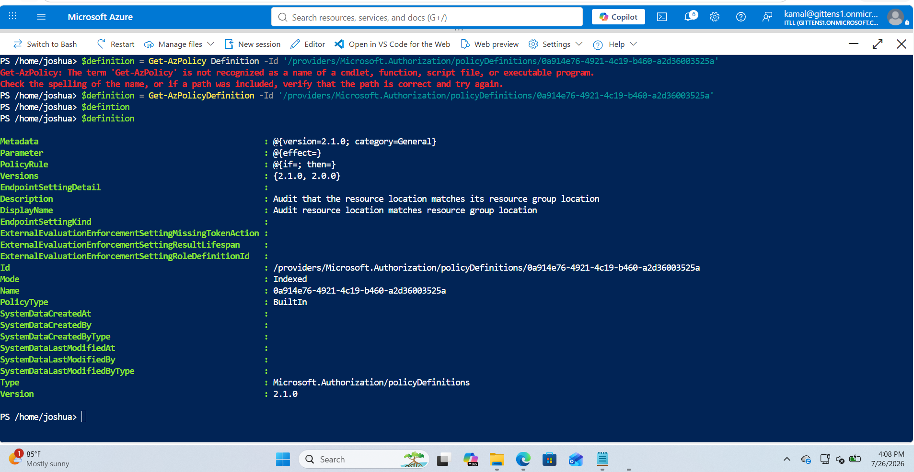
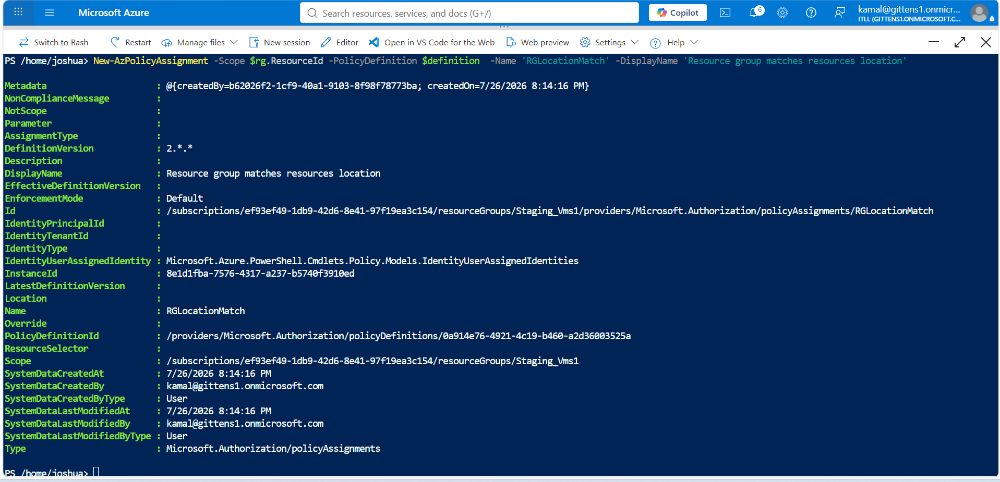
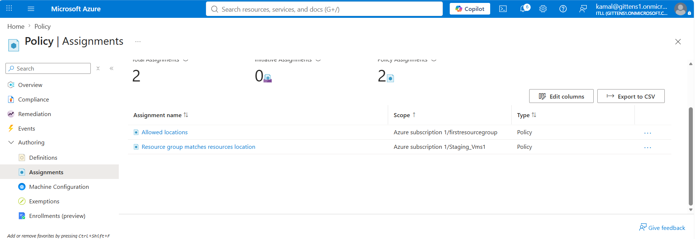

# Azure Policy Management with Azure PowerShell

## Overview

This lab demonstrates how to manage Azure Policy using Azure PowerShell. Instead of assigning policies through the Azure Portal, I used PowerShell cmdlets to create a resource group, retrieve a built-in Azure Policy Definition, and assign that policy programmatically.

The policy used in this lab audits whether resources are deployed in the same Azure region as their resource group. Automating policy assignments through PowerShell allows administrators to consistently enforce governance across Azure environments while reducing manual configuration.

---

## Technologies Used

- Microsoft Azure
- Azure Cloud Shell (PowerShell)
- Azure PowerShell (Az Module)
- Azure Policy
- Azure Resource Groups
- Azure Governance

---

## Skills Demonstrated

- Azure PowerShell administration
- Resource Group creation
- Azure Policy management
- Retrieving built-in policy definitions
- Assigning Azure Policies through PowerShell
- Governance automation
- Infrastructure as Code (IaC) concepts
- Azure Resource Manager (ARM)

---

# Lab Walkthrough

## Step 1 – Create a Resource Group Using Azure PowerShell

Instead of creating a resource group through the Azure Portal, I used Azure Cloud Shell with Azure PowerShell to provision a new resource group.

Creating Azure resources through PowerShell allows administrators to automate deployments, reduce manual configuration, and create repeatable infrastructure.

### PowerShell Command

```powershell
New-AzResourceGroup `
    -Name "Staging_Vms1" `
    -Location "East US"
```

The command successfully created a new resource group named **Staging_Vms1** in the **East US** region.

### Screenshot



---

## Step 2 – Retrieve the Resource Group

After creating the resource group, I retrieved it using Azure PowerShell and stored the object inside a variable.

This allows the resource group's information, including its Resource ID, to be reused later without manually copying values.

### PowerShell Command

```powershell
$rg = Get-AzResourceGroup `
    -Name "Staging_Vms1"
```

Using variables improves automation by allowing future commands to reference Azure resources directly.

### Screenshot



---

## Step 3 – Retrieve a Built-in Azure Policy Definition

Next, I retrieved one of Azure's built-in policy definitions using its Policy Definition ID.

The selected policy is:

**Audit resource location matches resource group location**

This built-in Azure Policy checks whether Azure resources are deployed in the same region as the Resource Group that contains them.

### PowerShell Command

```powershell
$definition = Get-AzPolicyDefinition `
    -Id "/providers/Microsoft.Authorization/policyDefinitions/0a914e76-4921-4c19-b460-a2d36003525a"
```

After retrieving the policy, I displayed the object to verify important properties such as:

- Display Name
- Description
- Policy Type
- Version
- Mode
- Policy Rule
- Policy ID

Successfully retrieving the policy confirms it is ready to be assigned programmatically.

### Screenshot



---

## Step 4 – Assign the Policy Using Azure PowerShell

With both the Resource Group and Policy Definition stored as PowerShell variables, I assigned the policy directly through Azure PowerShell.

### PowerShell Command

```powershell
New-AzPolicyAssignment `
    -Scope $rg.ResourceId `
    -PolicyDefinition $definition `
    -Name "RGLocationMatch" `
    -DisplayName "Resource group matches resources location"
```

The policy assignment was created successfully.

The output included important deployment information such as:

- Assignment Name
- Assignment ID
- Policy Definition ID
- Scope
- Enforcement Mode
- Definition Version

Using Azure PowerShell makes policy assignments repeatable and scalable across multiple environments.

### Screenshot



---

## Step 5 – Verify the Policy Assignment

Finally, I navigated to **Azure Policy → Assignments** to verify that the PowerShell deployment successfully created the assignment.

The new policy assignment appeared alongside previously configured policies.

Verification inside the Azure Portal confirms that the PowerShell deployment completed successfully and that Azure is actively managing the policy.

The assignment displays:

- Policy Name
- Assignment Scope
- Assignment Type

This confirms that the governance policy is now applied to the **Staging_Vms1** Resource Group.

### Screenshot



---

# Validation

The lab successfully demonstrated the following:

- Created a Resource Group using Azure PowerShell.
- Retrieved the Resource Group using PowerShell variables.
- Retrieved a built-in Azure Policy Definition.
- Assigned the policy programmatically using Azure PowerShell.
- Verified the successful policy assignment in the Azure Portal.

This confirms that Azure governance tasks can be fully automated using PowerShell rather than relying on manual configuration.

---

# What I Learned

This lab reinforced how Azure PowerShell can automate Azure governance tasks that are commonly performed through the Azure Portal.

I learned how to create Azure resources, retrieve built-in policy definitions, work with PowerShell variables, and assign governance policies programmatically. These skills improve consistency, reduce manual effort, and support Infrastructure as Code (IaC) practices for enterprise cloud environments.

Automating Azure Policy assignments allows administrators to deploy governance controls across multiple subscriptions and resource groups in a repeatable and scalable manner.

---

# Key Takeaways

- Azure PowerShell can automate Azure Policy management.
- Built-in policy definitions can be retrieved using their Policy Definition ID.
- PowerShell variables simplify automation by reusing Azure resource objects.
- Azure Policy assignments can be deployed without using the Azure Portal.
- PowerShell automation supports Infrastructure as Code (IaC) and enterprise governance best practices.
