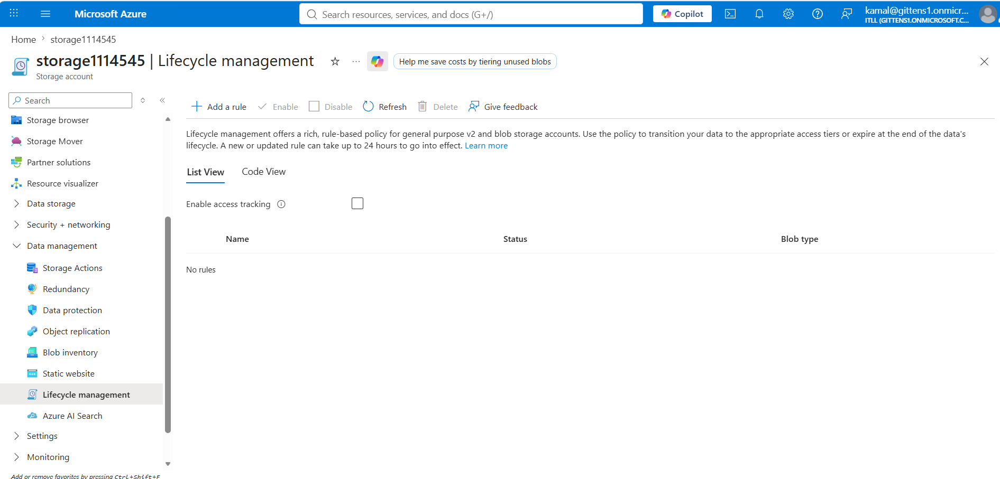
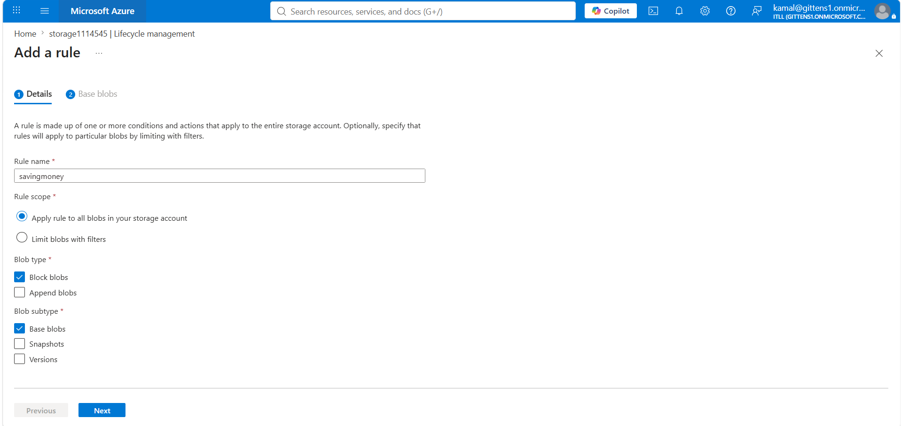
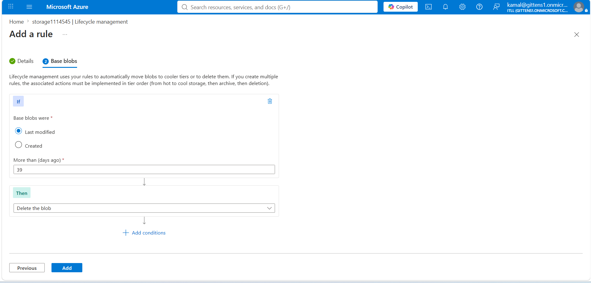
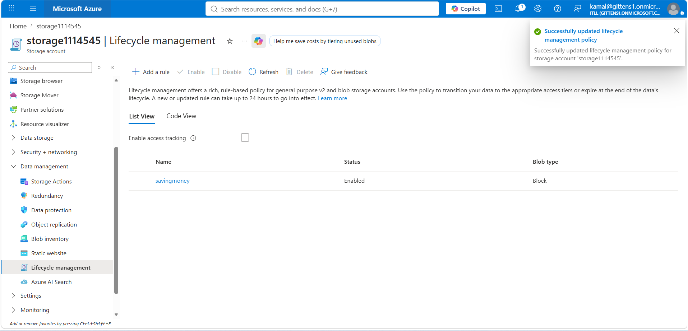

# Azure Blob Storage Lifecycle Management

## Overview

This lab demonstrates how I configured an Azure Blob Storage lifecycle management policy to automatically delete older blobs.

The goal was to create a rule that applies to block blobs across the storage account and removes blobs that have not been modified for more than 39 days.

Azure Lifecycle Management helps reduce storage costs and administrative overhead by automatically moving or deleting data based on defined conditions.

---

## Technologies Used

- Microsoft Azure
- Azure Storage Accounts
- Azure Blob Storage
- Lifecycle Management
- Block Blobs
- Azure Portal
- Azure Storage Policies

---

## Skills Demonstrated

- Configuring Azure Storage lifecycle rules
- Managing blob retention
- Automating blob deletion
- Applying rules to block blobs
- Reducing Azure storage costs
- Understanding blob lifecycle conditions
- Validating lifecycle policy deployment
- Azure Storage administration

---

# Why Lifecycle Management Matters

Azure Storage accounts can accumulate large amounts of data over time.

Without lifecycle policies, administrators may need to manually review and delete unused files. This can increase storage costs and create unnecessary administrative work.

Lifecycle Management allows Azure to automatically perform actions such as:

- Move blobs from the Hot tier to the Cool tier
- Move blobs from the Cool tier to the Archive tier
- Delete old blobs
- Delete old snapshots
- Delete previous blob versions

A lifecycle rule follows a basic structure:

```text
If a blob meets a condition
        |
        v
Perform an action automatically
```

For this lab, the rule was:

```text
If a block blob was last modified more than 39 days ago
        |
        v
Delete the blob
```

---

# Lab Walkthrough

## Step 1: Open Lifecycle Management

I opened the Azure Storage account and navigated to:

```text
Data management
    |
    v
Lifecycle management
```

At this point, no lifecycle rules were configured.

The Lifecycle Management page allows administrators to create rule-based policies for managing data throughout its lifecycle.

These policies can apply to:

- Base blobs
- Blob snapshots
- Blob versions
- Specific containers
- Blobs matching a prefix



---

## Step 2: Configure the Rule Details

I selected **Add a rule** and created a lifecycle rule named:

```text
savingmoney
```

The rule was configured to:

- Apply to all blobs in the storage account
- Target block blobs
- Apply to base blobs
- Exclude snapshots
- Exclude previous versions

### Rule Configuration

| Setting | Value |
|---|---|
| Rule name | savingmoney |
| Rule scope | Apply rule to all blobs in the storage account |
| Blob type | Block blobs |
| Blob subtype | Base blobs |
| Snapshots | Not selected |
| Versions | Not selected |

Applying the rule to all blobs means every matching block blob in the storage account can be evaluated by the lifecycle policy.



---

## Step 3: Define the Condition and Action

Next, I configured the condition that determines when Azure should apply the lifecycle action.

The condition was based on the blob's last modified date.

### Condition

```text
Base blobs were last modified more than 39 days ago
```

### Action

```text
Delete the blob
```

This means Azure will evaluate block blobs and automatically delete them once they have not been modified for more than 39 days.

### Rule Logic

```text
IF
    Blob type is a base block blob
AND
    Last modified date is more than 39 days ago
THEN
    Delete the blob
```



---

## Step 4: Verify the Lifecycle Policy

After adding the rule, Azure successfully updated the Lifecycle Management policy.

The rule appeared with the following configuration:

- Name: `savingmoney`
- Status: Enabled
- Blob type: Block

The success notification confirmed that the lifecycle policy was saved to the storage account.

Azure notes that new or updated lifecycle rules may take up to 24 hours to take effect.



---

# Rule Summary

| Property | Configuration |
|---|---|
| Rule name | savingmoney |
| Status | Enabled |
| Scope | All blobs in the storage account |
| Blob type | Block blobs |
| Blob subtype | Base blobs |
| Condition | Last modified more than 39 days ago |
| Action | Delete the blob |

---

# Lifecycle Policy Flow

```text
Azure Storage Account
        |
        v
Lifecycle Management Policy
        |
        v
Evaluate Block Blobs
        |
        v
Was the blob last modified more than 39 days ago?
        |
        +---- No ----> Keep the blob
        |
        +---- Yes ---> Delete the blob
```

---

# Cost Management Benefits

Azure Blob Storage charges depend partly on how much data is stored and which storage tier is being used.

Lifecycle policies help control storage costs by automatically managing data that is no longer actively needed.

For example, an organization may use rules such as:

```text
After 30 days:
Move blobs to the Cool tier

After 90 days:
Move blobs to the Archive tier

After 365 days:
Delete the blobs
```

This allows organizations to retain important data while reducing the cost of storing inactive files.

In this lab, I used automatic deletion after 39 days to demonstrate how Azure can remove outdated data without manual intervention.

---

# Lifecycle Actions

Azure Lifecycle Management supports several common actions.

## Move to Cool Storage

The Cool tier is designed for data that is accessed less frequently but still needs to remain immediately available.

Example:

```text
Move blobs to Cool after 30 days
```

## Move to Cold Storage

The Cold tier is intended for infrequently accessed data that still requires online access.

Example:

```text
Move blobs to Cold after 90 days
```

## Move to Archive Storage

The Archive tier offers lower storage costs for data that is rarely accessed.

Archived blobs are offline and must be rehydrated before they can be read.

Example:

```text
Move blobs to Archive after 180 days
```

## Delete Blobs

Azure can automatically delete blobs that are no longer required.

Example:

```text
Delete blobs after 365 days
```

The rule in this lab used the delete action.

---

# Base Blobs, Snapshots, and Versions

Lifecycle policies can apply to different types of blob data.

## Base Blobs

The primary version of the stored file.

This lab applied the rule to base blobs.

## Snapshots

Read-only copies of a blob created at a specific point in time.

Snapshots can have separate lifecycle rules.

## Blob Versions

Previous versions of a blob created when versioning is enabled.

Organizations may retain current blobs while deleting older versions after a specified period.

For this lab, snapshots and versions were not selected.

---

# Validation

This project successfully demonstrated:

- Opening Azure Storage Lifecycle Management
- Creating a lifecycle rule
- Naming the rule `savingmoney`
- Applying the rule to all blobs
- Targeting block blobs
- Applying the rule to base blobs
- Using the last modified date as the condition
- Configuring automatic deletion after 39 days
- Enabling the lifecycle policy
- Verifying the successful policy update

---

# Production Considerations

Before using automatic deletion in a production environment, administrators should review several factors.

## Data Retention Requirements

Confirm that deleting data after the configured period does not violate:

- Business retention requirements
- Legal requirements
- Regulatory requirements
- Audit requirements
- Backup policies

## Recovery Options

Consider enabling:

- Blob soft delete
- Container soft delete
- Blob versioning
- Backup protection

These features can reduce the risk of permanent data loss.

## Rule Scope

In production, it may be safer to limit a rule using:

- Blob name prefixes
- Blob index tags
- Specific containers

For example:

```text
logs/
temp/
archive/
```

This prevents the rule from affecting unrelated data.

## Testing

Lifecycle policies should be tested with non-production data before being applied broadly.

Administrators should verify:

- The correct containers are included
- The correct blob types are targeted
- The retention period is correct
- The selected action matches business requirements

---

# Example of a More Advanced Lifecycle Strategy

```text
Rule 1
If a blob has not been modified for 30 days
Move it to the Cool tier

Rule 2
If a blob has not been modified for 90 days
Move it to the Archive tier

Rule 3
If a blob has not been modified for 365 days
Delete it
```

This type of tiered lifecycle strategy can reduce costs while preserving data for the required retention period.

---

# What I Learned

This lab helped me understand how Azure Storage Lifecycle Management automates data retention and cost management.

I learned how to create a lifecycle rule, define its scope, target a specific blob type, and configure an action based on the last modified date.

I also learned that lifecycle management policies can be used for more than deletion. They can automatically move data between the Hot, Cool, Cold, and Archive tiers as access patterns change.

The lab reinforced the importance of carefully reviewing lifecycle rules before applying them in production because automated deletion can permanently remove data.

---

# Key Takeaways

- Azure Lifecycle Management automates blob storage operations.
- Rules can evaluate blobs based on age and modification date.
- Policies can apply to base blobs, snapshots, and versions.
- Blob lifecycle rules can move data between storage tiers.
- Old blobs can be deleted automatically.
- Lifecycle policies help reduce storage costs.
- Rules can apply to all blobs or be limited with filters.
- New or updated lifecycle rules may take up to 24 hours to take effect.
- Automatic deletion should be tested carefully before production use.
- Data retention and recovery requirements should be reviewed before enabling deletion policies.

---

# Resume Bullet

> Configured an Azure Blob Storage lifecycle management policy to automatically delete block blobs that had not been modified for more than 39 days, reducing manual administration and supporting cloud storage cost optimization.

---

# Interview Explanation

> I created an Azure Storage lifecycle management rule named `savingmoney`. The policy applied to base block blobs across the storage account and automatically deleted blobs that had not been modified for more than 39 days. This helped me understand how Azure can automate data retention and reduce storage costs. I also reviewed how lifecycle policies can move data between Hot, Cool, Cold, and Archive tiers instead of immediately deleting it.
