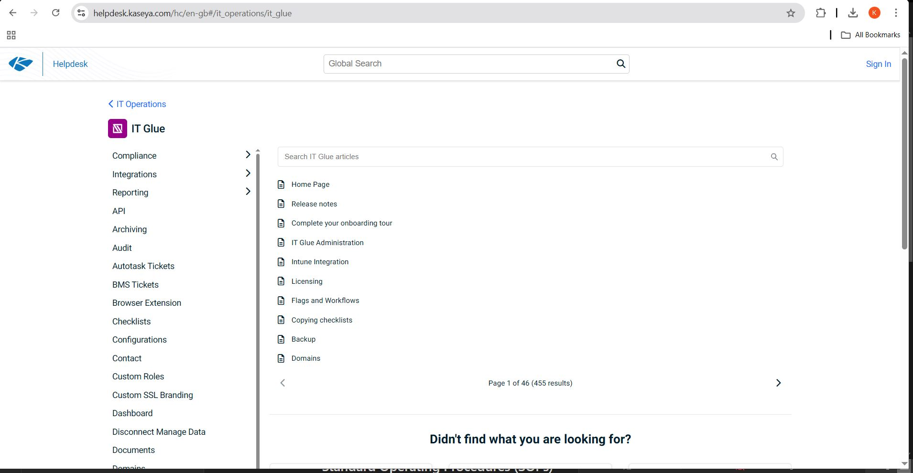

# IT Glue Documentation

## Introduction

### What is IT Glue?
IT Glue is a cloud-based IT documentation platform designed for Managed Service Providers (MSPs) and IT teams. It provides a centralized repository for storing and managing IT documentation, enabling teams to access critical information efficiently.

### Importance of IT Glue
- **Efficiency**: Reduces troubleshooting time by providing quick access to documented solutions.
- **Consistency**: Ensures standardized documentation across the IT team.
- **Accountability**: Tracks updates and changes for better audit control.

### Why Good Documentation Matters in IT Support
- Helps resolve issues faster by referencing past solutions.
- Reduces repetitive tasks by providing clear Standard Operating Procedures (SOPs).
- Enhances collaboration among team members.
- Ensures continuity when staff changes occur.

### Limitations of This Documentation
Due to the lack of access to an IT Glue trial version, this documentation is based on extensive research from industry resources, including YouTube tutorials, official documentation, and IT support knowledge bases. While screenshots cannot be included, the structured guidelines and mock data closely replicate real-world IT documentation practices used in MSP environments.

## IT Glue Structure
IT Glue is structured to provide a logical and organized way to store and retrieve IT documentation. Below are the key components:

### 1. IT Assets
This section includes documentation on all key IT assets managed by the MSP or IT team. It is categorized into three primary areas:

#### **Network Devices**
- Firewalls (e.g., Cisco ASA, pfSense, Meraki)
- Switches (e.g., Cisco, HP, Unifi)
- Routers
- VPN appliances
- Wireless access points

#### **Servers**
- Active Directory Domain Controllers
- File Servers
- Remote Desktop Servers
- Microsoft Exchange Servers
- Virtualization Hosts (Hyper-V, VMware ESXi)

#### **Applications**
- Microsoft 365 (Exchange, SharePoint, Teams)
- Microsoft Intune (Device Management, Policies)
- Ticketing Systems (ConnectWise, Zendesk, Freshdesk)
- Backup Solutions (Veeam, Acronis, Datto)
- Security Software (CrowdStrike, SentinelOne)

Each IT asset entry in IT Glue contains:
- **Name** (e.g., AD-DC01)
- **IP Address** (e.g., 192.168.1.10)
- **Location** (e.g., Data Center, Remote Office)
- **Role/Purpose** (e.g., Domain Controller, VPN Gateway)
- **Configuration Details** (e.g., OS Version, Installed Services)
- **Credentials** (if applicable, securely stored)
- **Related Documentation** (linked troubleshooting guides and SOPs

### 2. Standard Operating Procedures (SOPs)
SOPs provide step-by-step instructions for common IT support issues. These ensure consistency and efficiency when resolving recurring issues.

#### **Examples of SOPs in IT Glue:**
- **Password Reset** (Active Directory, Microsoft 365)
- **New User Onboarding** (Creating accounts, setting permissions)
- **VPN Setup & Troubleshooting**
- **Printer Installation & Troubleshooting**
- **Software Deployment via Intune or PDQ Deploy**
- **Updating IT Glue Documentation**

Each SOP entry in IT Glue includes:
- **Purpose** (Why the procedure exists)
- **Prerequisites** (Any necessary information before starting)
- **Step-by-Step Guide** (Clear instructions with expected outcomes)
- **Troubleshooting Tips** (Common errors and resolutions)
- **Update Log** (Record of changes to the procedure)

### 3. Common Fixes & Workarounds
This section in IT Glue stores documentation for resolving frequently encountered issues. 
