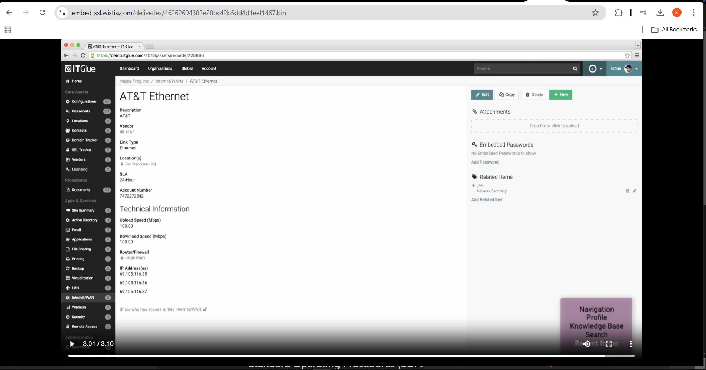

# IT Documentation Templates

IT documentation is essential for managing IT assets, troubleshooting issues, and ensuring smooth operations in an MSP or IT support environment. A well-structured documentation system improves efficiency, reduces resolution times, and ensures consistency across IT teams. This document provides structured templates for documenting servers, network devices, Microsoft 365, standard operating procedures (SOPs), and troubleshooting guides.

Effective IT documentation should:
- Be **clear and concise** to help fellow IT workers to find information quickly.
- Follow a **consistent format** for ease of use.
- Be **updated regularly** to ensure accuracy.

## **1. Server Documentation**

# Server Name: [SERVER-2022]
## General Information
- **Role:** [Domain Controller / File Server / Application Server]
- **Operating System:** [Windows Server 2022]
- **IP Address:** [192.168.1.X]
- **Location:** [On-Prem / Cloud (Azure, AWS)]
- **Administrator Account:** [Documented in IT Glue / Vault]
- **Last Maintenance Date:** [YYYY-MM-DD]

## Services Running
- **Active Directory / DHCP / DNS**
- **File Sharing / Print Services**
- **Virtualization  / VMware**

## Backup & Recovery
- **Backup Solution:** [Veeam / Azure Backup / Acronis]
- **Retention Policy:** [Daily / Weekly / Monthly]
- **Recovery Procedure:** [Step-by-step guide]

## Monitoring & Alerts
- **Monitoring Tool:** [ SolarWinds / ConnectWise Automate]
- **Alerting Method:** [Email / Ticket Creation]
---
## **2. Network Device Documentation (Router, Switch, Firewall)**
