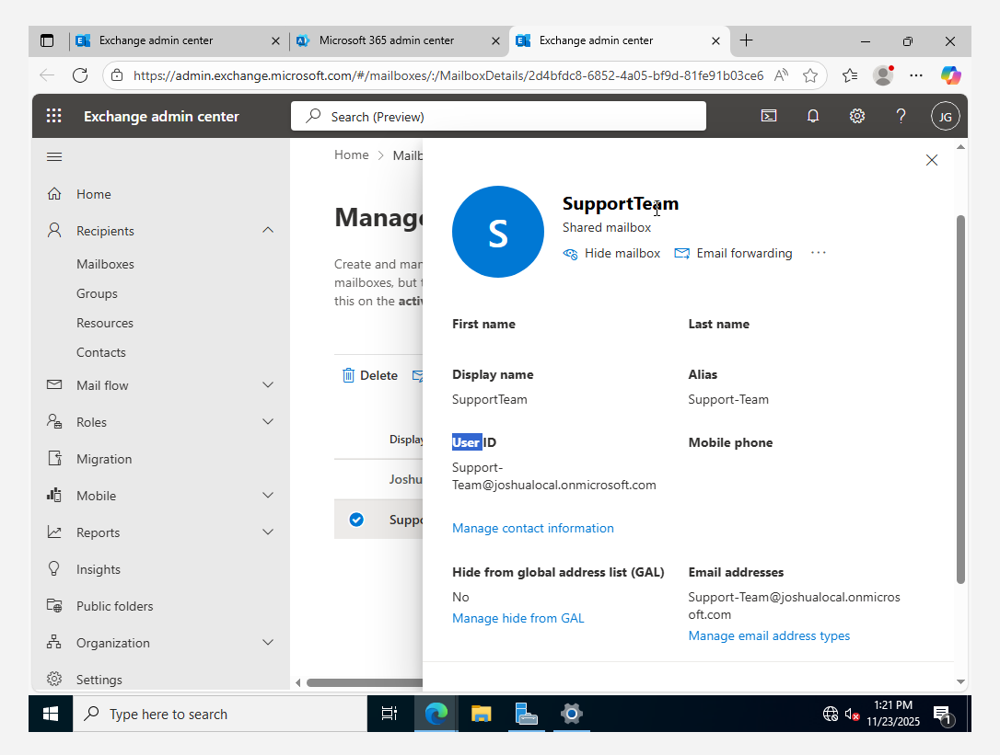

# Exchange Administration

Microsoft Exchange Administration involves managing **email services, mail flow, recipients, security policies**, and troubleshooting email-related issues within an organization.  

As a **IT Support** technician, I will handle tasks related to **user mailboxes, shared mailboxes, groups, email forwarding, message tracing, and mail flow rules** using the **Exchange Admin Center (EAC)** or **PowerShell**.

---
## Key Responsibilities in Exchange Administration  

### 1️ Managing Recipients (Mailboxes, Groups, Contacts, and Resources)  
- Create, modify, and delete **user mailboxes**.  
- Manage **shared mailboxes** and **distribution groups**.  
- Configure **resource mailboxes** for meeting rooms and equipment.  
- Create **mail contacts** for external users.  
### 2️ Mail Flow Management  
- Configure **mail transport rules** (to filter or route emails).  
- Monitor **email queues** and troubleshoot undelivered emails.   
### 3 Message Tracking & Troubleshooting  
- Use **Message Trace** to investigate email delivery issues.  
- Check **Remote Domains & Accepted Domains** for external email communication.  
- Monitor **alerts and audit logs** for compliance.  

---
### 1. How to Create a Shared Mailbox

A **shared mailbox** allows multiple users to access and send emails from a single mailbox (e.g., `Support-joshua@local.onmicrosoft.com`).  
#### **Steps:**  
1. Go to **Exchange Admin Center**.  
2. Navigate to **Recipients > Mailboxes**.  
3. Click **Add Mailbox > Shared Mailbox**.  
4. Enter a **name** (e.g., "Procurement-Team") and **email address** (e.g., `Support-Team@Njikason.onmicosoft.com).  
5. Click **Create** and wait for the mailbox to be provisioned.  
6. Assign users who should have access by clicking **Add Members**.  
7. Click **Save**.  

 **Users can now access this shared mailbox in Outlook under "Shared Mailboxes."**  

---

###  2. How to Create a Group (Distribution List & Microsoft 365 Group)

Groups allow multiple users to receive emails sent to a single email address.  

#### **For a Distribution List:**  
1. Go to **Recipients > Groups**.  
2. Click **Add Group > Select Distribution**.  
3. Enter a **name, email, and description**.  
4. Add members who should receive emails sent to this group.  
5. Click **Create**.  

#### **For a Microsoft 365 Group (with shared resources like Teams & SharePoint):**  
1. Go to **Microsoft 365 Admin Center > Groups > Active Groups**.  
2. Click **Add Group > Choose Microsoft 365 Group**.  
3. Enter a **name, email, and description**.  
4. Set **permissions** (Public or Private).  
5. Click **Create**. 
6. You can also create **Microsoft 365 Group** in Exchange Admin portal as-well.

 **Now, emails sent to the group email address will be received by all members.**  

---

### **3. How to Manage Resources (Meeting Rooms & Equipment Mailboxes)**

A **resource mailbox** is used to schedule **meeting rooms or equipment**.  

#### **Steps:**  
1. Go to **Recipients > Resources**.  
2. Click **Add Resource > Choose Room Mailbox or Equipment Mailbox**.  
3. Enter a **name** (e.g., "Conference Room A") and **email address**.  
4. Configure **booking options** (auto-accept requests or manual approval).  
5. Click **Save**.  

 **Users can now book this resource when scheduling meetings in Outlook.**  

---
### **4. How to Perform Message Trace (Track Email Deliveries & Failures)**  

**Message Trace** helps track if an email was successfully delivered, delayed, or failed. 
