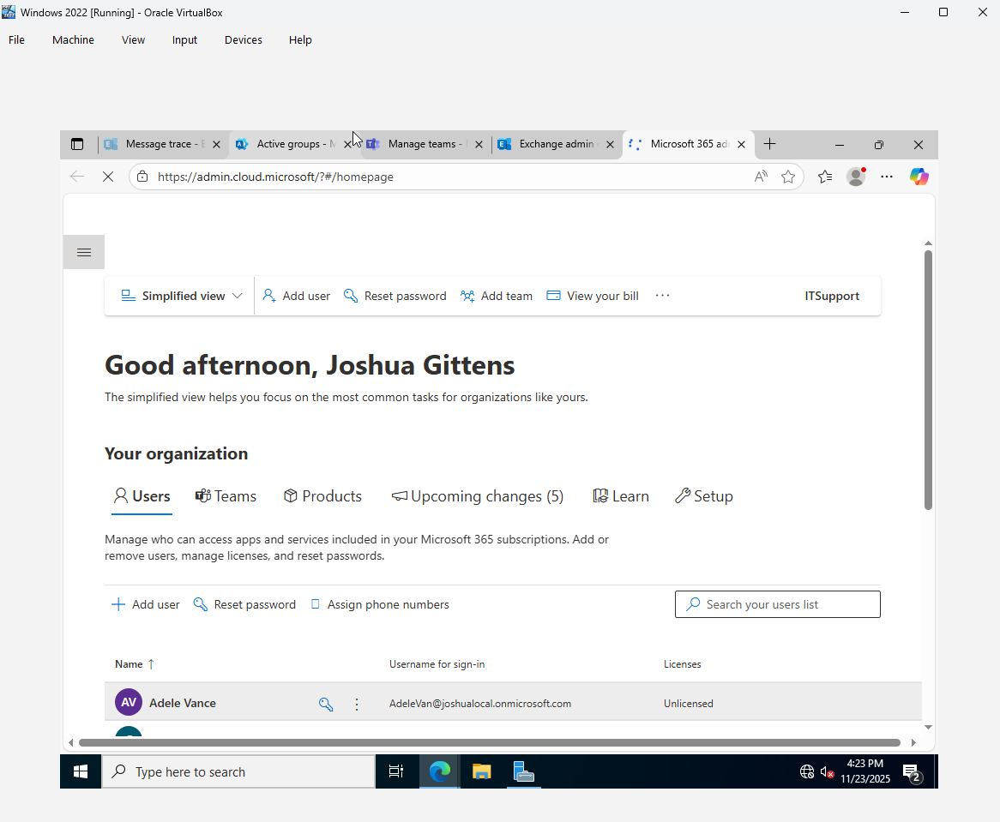
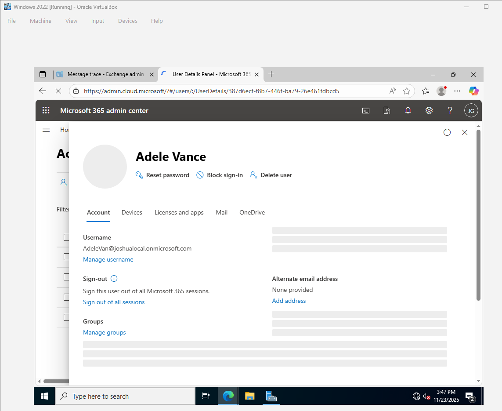
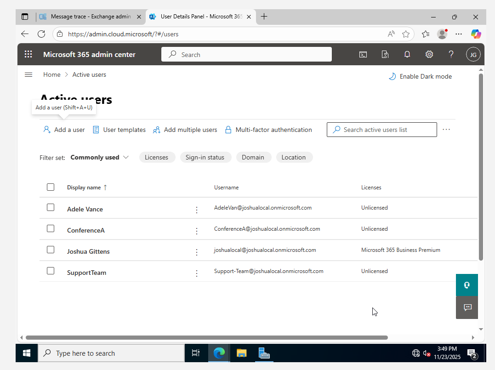

---
# Microsoft 365 Admin Documentation

### What is Microsoft 365?  
Microsoft 365 is a **cloud-based suite of productivity and security tools** offered by Microsoft. It includes **Office apps, cloud storage, email, collaboration tools, and security features** to help businesses manage their IT infrastructure.
### Key Components of Microsoft 365  
- **Exchange Online** – Cloud-based email hosting and management.  
- **SharePoint Online** – Document storage, intranet, and collaboration platform.  
- **Microsoft Teams** – Chat, video conferencing, and team collaboration tool.  
- **Microsoft Intune** – Device and application management (MDM/MAM).  
- **Azure AD (Entra ID)** – Identity and access management (IAM).  

### Role of Microsoft 365 Admin Center  
The **Microsoft 365 Admin Center** is a web-based portal used by IT administrators to:  
- **Manage users and groups**  
- **Assign licenses and subscriptions**  
- **Monitor service health and security**  
- **Configure security and compliance settings**  
- **Manage Microsoft 365 services like Exchange, SharePoint, and Teams**  
## 2. User Management  

### Creating, Deleting, and Restoring Users  

#### **Creating a New User in Microsoft 365 Admin Center**  
1. Go to **[Microsoft 365 Admin Center](https://admin.microsoft.com/)**  
2. Navigate to **Users > Active users**  
3. Click **Add a user**  
4. Fill in user details:  
   - **Name**  
   - **Username (email address)**  
   - **Password (auto-generated or manual)**  
   - **Assign a license** (Microsoft 365 Business Premium, E3, etc.)  
   - **Set roles** (User, Admin)  
5. Click **Add user**  
---

#### **Deleting a User**  
1. Go to **Users > Active users**  
2. Select the user you want to delete  
3. Click **Delete user**  
#### **Restoring a Deleted User**  
1. Go to **Users > Deleted users**  
2. Select the user you want to restore  
3. Click **Restore user**  
4. Assign a license (if required)  

---
### Assigning and Managing Licenses  

1. Go to **Users > Active users**  
2. Click on a user’s name  
3. Go to the **Licenses and apps** tab  
4. Select the appropriate Microsoft 365 license (E3, Business Premium, etc.)  
5. Click **Save changes**  

#### **Bulk License Assignment**  
1. Select multiple users  
2. Click **Edit product licenses**  
3. Choose a license and click **Save changes**  
---
### Resetting Passwords and MFA Setup  
