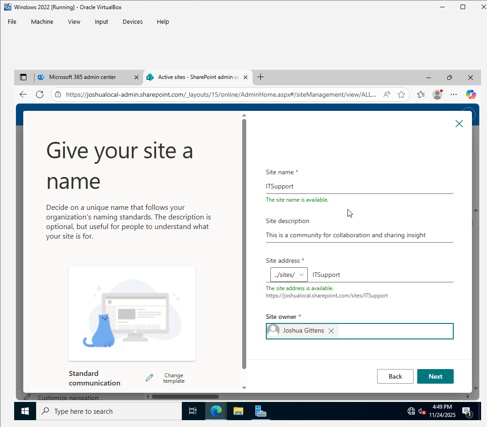
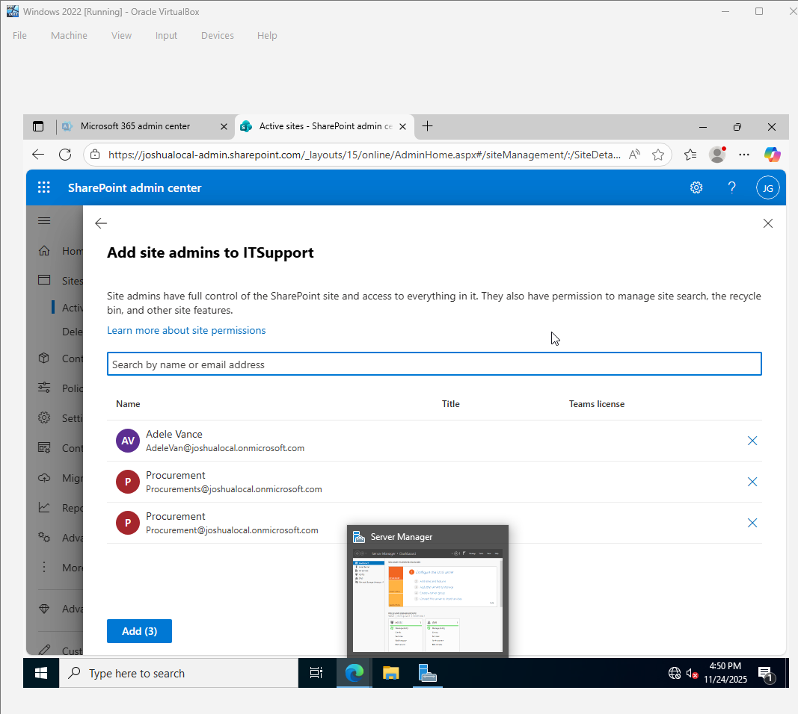

# Introduction to SharePoint  

## What is SharePoint?  
SharePoint is a Microsoft platform that helps organizations **store, manage, and share** documents and information. It is mainly used for:  

- **Collaboration** – Teams can work together on documents in real-time.  
- **Document Storage** – Securely store and organize company files.  
- **Internal Websites (Intranet)** – Create internal portals for company news and resources.  

### **Common Uses of SharePoint**  
Companies use SharePoint for:  
✔ **Storing and organizing files** securely.  
✔ **Creating team and communication sites** for collaboration.  
✔ **Automating workflows and approvals** to streamline processes.  
✔ **Managing company-wide announcements and resources** on intranet pages.  

---

## What is a SharePoint Admin?  
A **SharePoint Admin** is responsible for managing SharePoint in an organization. Their main tasks include:  

### **Key Responsibilities**  
- **Creating and Managing SharePoint Sites** – Setting up team and communication sites.  
- **Controlling Permissions and Access** – Managing who can view and edit content.  
- **Monitoring Site Storage and Usage** – Ensuring storage limits are not exceeded.  
- **Enforcing Security Policies** – Implementing restrictions like external sharing limits.  
- **Troubleshooting Issues** – Resolving errors like missing files and access problems.  
---

# SharePoint Admin Guide for IT Support  

## 1. Creating and Managing Sites  
As an IT support person, you may need to create and manage SharePoint sites.  

### Create a New Site  
1. Go to [Microsoft 365 Admin Center](https://admin.microsoft.com).  
2. Click **SharePoint** under **Admin centers** to open the **SharePoint Admin Center**.  
3. Click **"Create"** at the top of the page.  
4. Choose the type of site:  
   - **Team Site** (for collaboration with a team).  
   - **Communication Site** (for sharing company-wide information).  
5. Enter a **site name** and set **permissions** (private or public).  
6. Click **"Finish"**, and the site will be created.  

### Manage Existing Sites  
1. In the **SharePoint Admin Center**, go to **Sites > Active Sites**.  
2. Find the site you want to manage.  
3. Click on the site name to open settings.  
4. You can:  
   - Change **site owners and members**.  
   - Adjust **site storage limits**.  
   - **Delete or restore** a site.  

---
## 2. Managing Permissions
