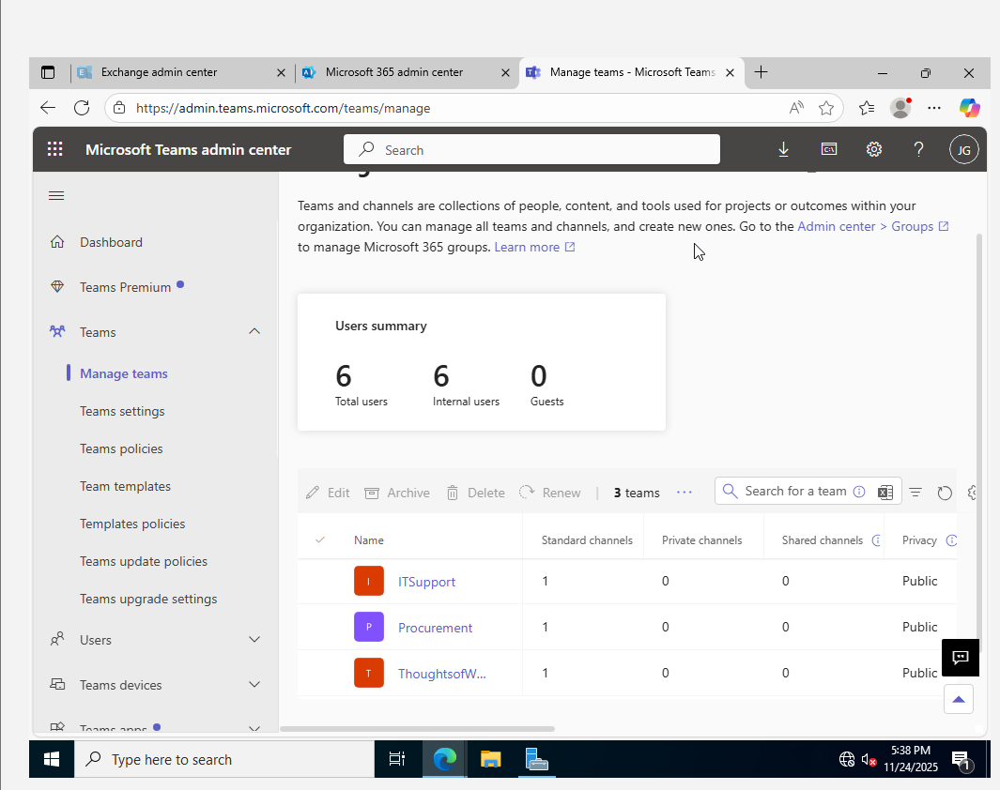
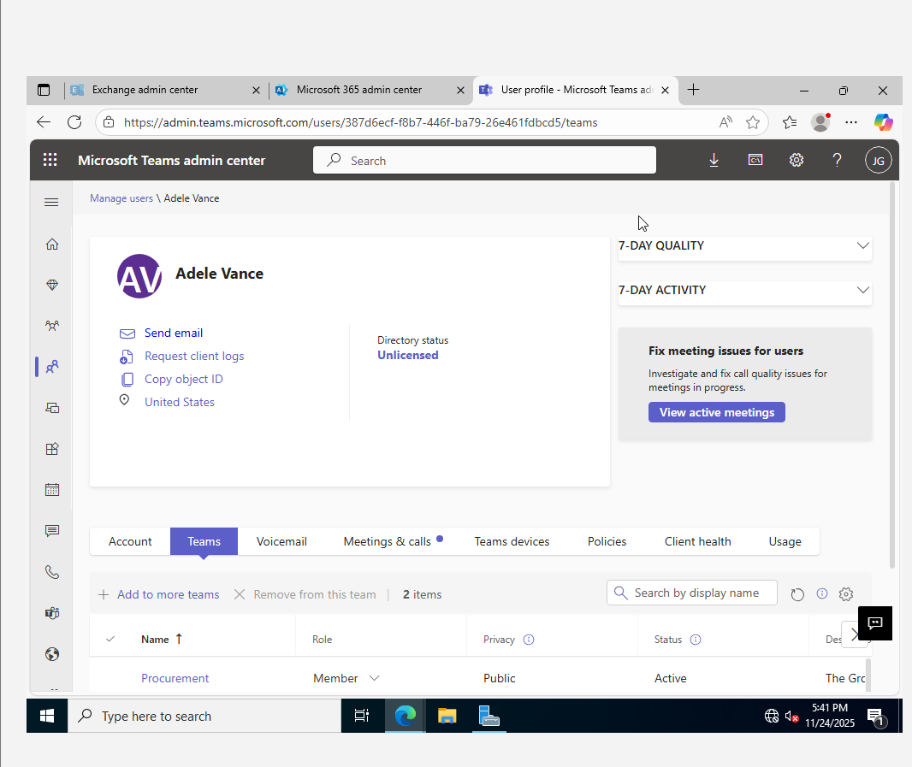

## 1. Introduction to Microsoft Teams

### What is Microsoft Teams?
Microsoft Teams is a collaboration platform within Microsoft 365 that provides chat, video meetings, file sharing, enforce policies and integration with apps to enhance team productivity.

### What is a Microsoft Teams Administrator?
A Microsoft Teams Administrator is responsible for managing Teams settings, user access, policies, and security. Their role includes:
- Managing users, teams, and channels.
- Configuring security, compliance, and guest access.
- Managing meetings, calling, and messaging policies.
- Integrating apps and workflows.

---
## 2. Features of Microsoft Teams Admin Center

The **Teams Admin Center** allows administrators to:
- Manage teams, users, and permissions.
- Configure security and compliance settings.
- Control meeting, calling, and messaging policies.
- Enable guest and external access.
- Integrate third-party applications.
- Apply and enforce Teams policies.

To access the Teams Admin Center, go to [Microsoft Teams Admin Center](https://admin.teams.microsoft.com)and click on Teams.

---
## 3. Managing Teams and Workspaces

### Create a Team
1. Open **Teams Admin Center**.
2. Navigate to **Teams** > **Manage Teams**.
3. Click **+ Add a Team**.
4. Choose **Public** or **Private**.
5. Enter a **Team Name** and **Description**.
6. Click **Create** and add members if needed.

### Delete a Team
1. Go to **Teams Admin Center** > **Manage Teams**.
2. Select the team to delete.
3. Click **Delete** and confirm.
---
## 4. Managing Users in Teams

### Add a User to Teams
1. Open **Teams Admin Center**.
2. Go to **Users** > **Manage Users**.
3. Click **+ Add User**.
4. Enter the user's email or username.
5. Assign roles and click **Save**.

### Manage Existing Users
1. In **Teams Admin Center**, go to **Users**.
2. Select a user to manage their settings.
3. Edit policies, roles, or permissions as needed.

---
## 5. Guest Access in Teams
Guest access allows external users to join a team with limited permissions.
### Enable Guest Access
1. Open **Teams Admin Center**.
2. Navigate to **Org-wide settings** > **Guest Access**.
3. Toggle **Allow guest access in Teams** to **On**.
4. Configure guest permissions (calls, meetings, and messaging).
5. Click **Save**.
### Add a Guest to a Team
1. Open **Microsoft Teams**.
2. Go to the **Team** where you want to add a guest.
3. Click **More options (⋮)** > **Manage Team**.
4. Click **+ Add Member**.
5. Enter the guest’s email address.
6. Click **Add** and assign permissions.

---
## 6. External Access in Teams

External access allows communication with users outside the organization.
### Enable External Access
1. Open **Teams Admin Center**.
2. Go to **Org-wide settings** > **External Access**.
3. Toggle **Allow external access** to **On**.
4. Specify allowed or blocked domains.
5. Click **Save**.
---
## 7. Managing Teams Policies

Policies in Teams help enforce security and compliance.
### Configure Teams Policies
1. Open **Teams Admin Center**.
2. Navigate to **Teams policies**.
3. Click **+ Add** to create a new policy or select an existing one.
4. Set restrictions on messaging, file sharing, or meeting capabilities.
5. Assign the policy to users or groups.
6. Click **Save**.
### Assign Policies to Users
1. In **Teams Admin Center**, go to **Users**.
2. Select a user.
3. Under **Policies**, click **Edit**.
4. Assign the required policies.
5. Click **Save**.
---
## 9. Managing Channels in Teams
