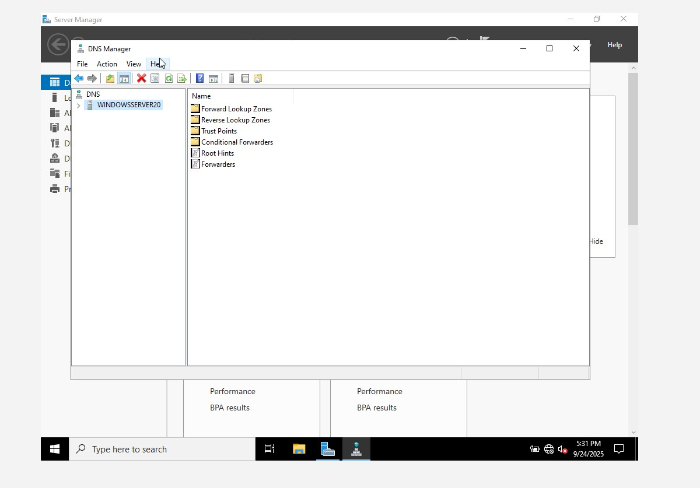

# DNS

## What is DNS?

DNS (Domain Name System) is a protocol that translates human-readable domain names (E.g. google.com) into IP addresses (E.g. 142.250.190.78), allowing computers to locate and communicate with each other over the Internet or a private network.

---
## DNS Server

A DNS Server is a computer or network device that stores and manages domain name records and responds to DNS queries by resolving domain names into IP addresses.

---
> **Tip:** Before installing DNS in the server, the server needs to have a static IP address.

- Navigate to the Server Manager → Local Server → on the page that's up → go to `Ethernet0` → click on it → `Ethernet0 Properties`
- Click on **Internet Protocol Version 4 (TCP/IPv4)** → Properties
  - → Use the following IP address (Static IP address)
- Disable **Internet Protocol Version 6 (TCP/IPv6)** and close

---

> If you go back to the Local Server, you will observe the static IP that was just create

# Installing DNS Server

1. Go to **Server Manager**  
2. On the top, click on **Manage** → **Add Roles & Features**  
3. Click **Next** before you begin  
4. **Role-based or feature-based installation** → **Next**  
5. **Server Selection** → **Next**  
6. **Server Roles** (click on **DNS Server**) → Add role and click **Next**  
7. Click **Next** and **Install**

---

## Navigating to DNS Zones

1. Navigate to **Tools** on the Server Manager and click on **DNS**  
2. Under **Server 2022**, expand →  
   - **Forward Lookup Zones**  
   - **Reverse Lookup Zones**

---

## Forward Lookup Zones (FLZ)
