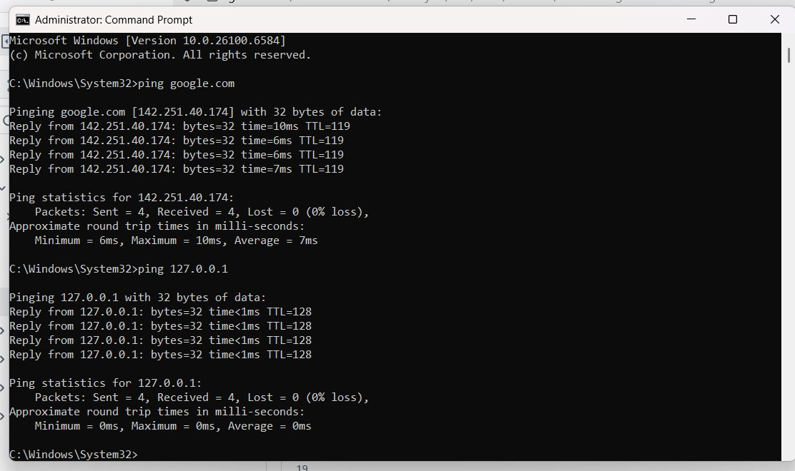
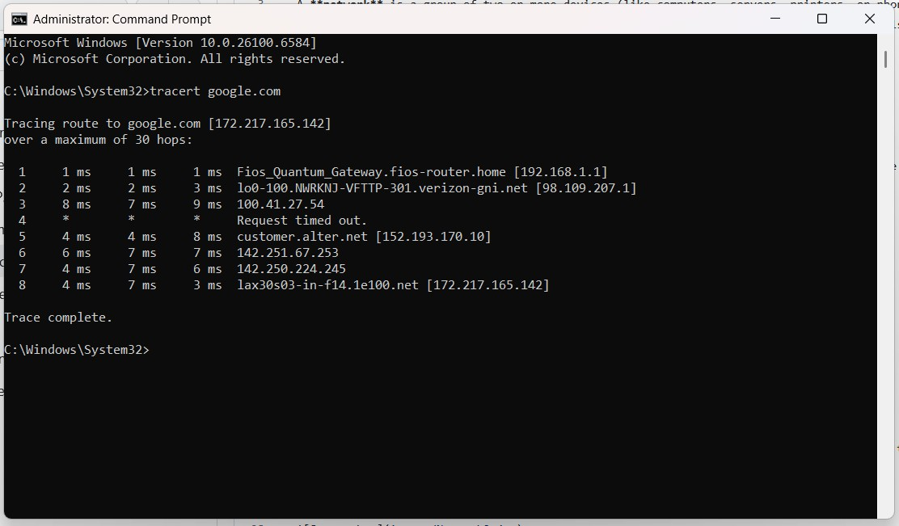
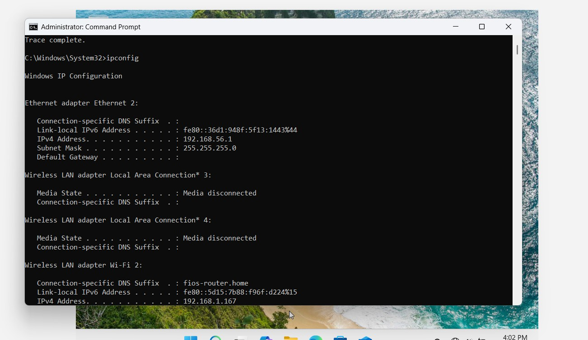

# Network Troubleshooting 

A **network** is a group of two or more devices (like computers, servers, printers, or phones) that are connected together to share resources and communicate. Troubleshooting network is essential part of IT support role learning it improves my skills further in networking.

---
## How to Diagnose Issues for Network Troubleshooting

### What is Ping and How to Ping a Network

- **Ping** is a command used to check if your computer can communicate with another device (like a website or a router).

#### Steps:
1. Open **Command Prompt** (Press `Windows + R`, type `cmd` and press Enter).
2. Common ping tests to check network connectivity:
   - `ping google.com` or `ping 8.8.8.8`
   - `[your default gateway]` or `ping 8.8.8.8`
   - `[127.0.0.1]` (Check your computer's network loopback)

---
## Tracert (Trace Route)

- `tracert` (short for **trace route**) shows the path that data takes from your computer to a destination, like reaching a particular website.
#### Steps:
1. Open **Command Prompt**
2. Type : `tracert google.com`

- It show a list of hops (routers) the data passes through.
- If a website is slow or not loading, `tracert` show **where the slowdown is happening**.
---
# What is ipconfig and How to Use it for Network Troubleshooting

**ipconfig** is a Windows command that shows your computer's network settings, such as: 
- IP address
- Subnet mask
- DNS server
- Default gateway
## How to Use ipconfig

### Basic Command
- Open **Command Prompt**
- Type: `ipconfig`
   - This shows your basic IP information

### Detailed Info
  
