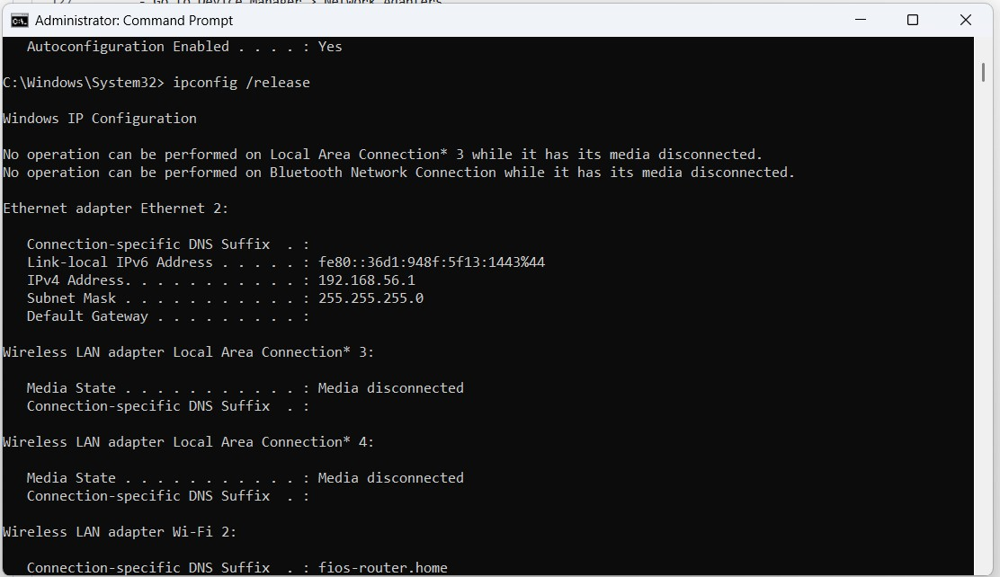

# Network Troubleshooting 

A **network** is a group of two or more devices (like computers, servers, printers, or phones) that are connected together to share resources and communicate. Troubleshooting network is essential part of IT support role learning it improves my skills further in networking.

---
## How to Diagnose Issues for Network Troubleshooting

### What is Ping and How to Ping a Network

- **Ping** is a command used to check if your computer can communicate with another device (like a website or a router).

#### Steps:
1. Open **Command Prompt** (Press `Windows + R`, type `cmd` and press Enter).
2. Common ping tests to check network connectivity:
   - `ping google.com` or `ping 8.8.8.8`
   - `[your default gateway]` or `ping 8.8.8.8`
   - `[127.0.0.1]` (Check your computer's network loopback)


---
## Tracert (Trace Route)

- `tracert` (short for **trace route**) shows the path that data takes from your computer to a destination, like reaching a particular website.
#### Steps:
1. Open **Command Prompt**
2. Type : `tracert google.com`

- It show a list of hops (routers) the data passes through.
- If a website is slow or not loading, `tracert` show **where the slowdown is happening**.
---
# What is ipconfig and How to Use it for Network Troubleshooting

**ipconfig** is a Windows command that shows your computer's network settings, such as: 
- IP address
- Subnet mask
- DNS server
- Default gateway
## How to Use ipconfig

### Basic Command
- Open **Command Prompt**
- Type: `ipconfig`
   - This shows your basic IP information

### Detailed Info
- Type: `ipconfig/all`
  - Shows detailed info like:
    - MAC address
    - DHCP status
    - DNS suffix

---
## Troubleshooting APIPA (Authomatic Private IP Address)

- If your IP address falls within the range:
  - `169.254.1.0` to `169.254.254.255`
  - This is called an **APIPA address**, which means **no internet access**.
### Solution
1. Run command `ipconfig /release`
2. Then: `ipconfig /renew`
    → This will request a new IP address from the router.

---
## Disable & Enable Network Adapter (Reset a Network Adapter)

1. Go to **Search** and type: `Control Panel`
2. Navigate to:
   `Network & Internet` → `Network & Sharing Center` →
   `Change adapter settings`
3. Right-click your Wi-Fi or Ethernet adapter.
4. Click **Disable**
5. Wait a few seconds, then click **Enable** again.
6. **Ask the user** :
   - Is the issue only affecting them or multiple people?

 **Check physical connections**:
   - Is the device connected to Wi-Fi or Ethernet?
   - Is the network cable plugged in properly?
   - Is thee switch/router powered and functioning?

  . **Run `ipconfig`**:
    - Open Command Prompt and type:
      ```
      ipconfig /all
      ```
   - Check:
     - IPv4 Address
     - Default Gateway
     - DNS Servers
     - Is there an IP or "Media disconnected"?
   
   **Run `ping` tests**:

        ```
      - Google DNS (tests internet connectivity):
        ```
       ping 8.8.8.8
        ```
   . **Run `nslookup`**:
   - Test DNS resolution:
     ```
     nslookup google.com
     ```
   - If this fails, DNS may be the issue.

 **Run `tracert`**:
   - Trace where the connection fails:
     ```
     tracert google.com
     ```
   - Check which hop fails—could indicate a routing or ISP issue.

 **Reset Network Adapter**:
   - Disable/Enable the adapter:
     - Control Panel > Network and Sharing Center > Change Adapter Settings
     - Right-click > Disable > wait > Enable
    
 **Swap DNS to Google**:
   - Go to: Control Panel > Network Adapter > Properties > IPv4
   - Use custom DNS:
     ```
     Preferred DNS: 8.8.8.8
     Alternate DNS: 8.8.4.4
     ```
 **Update Network/Wi-Fi Drivers**:
    - Go to Device Manager > Network Adapters
    - Right-click the adapter > Update Driver
    - Or download latest from manufacturer’s website

 **Restart Router/Modem**:
   - Power cycle router (off for 30 seconds, then on)
   - Wait for internet light to stabilize
## Network Troubleshooting


   
