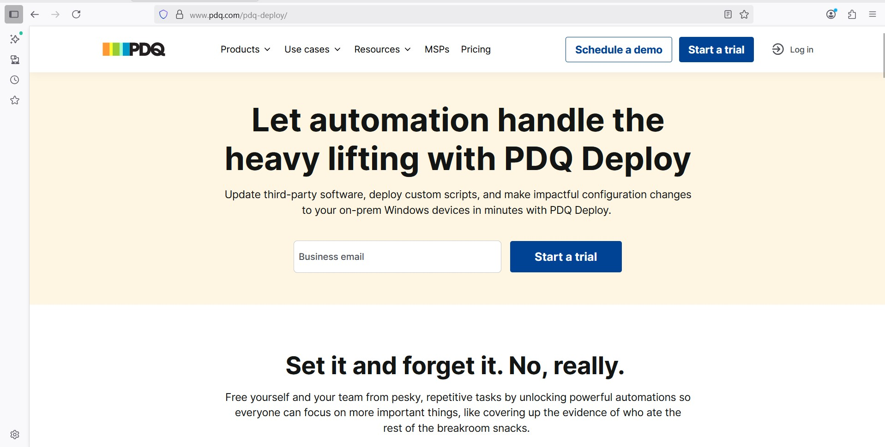
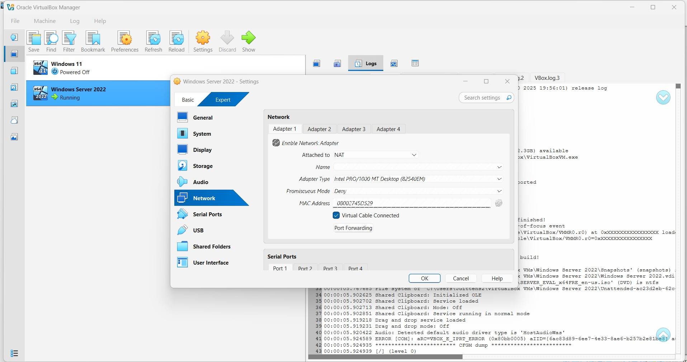
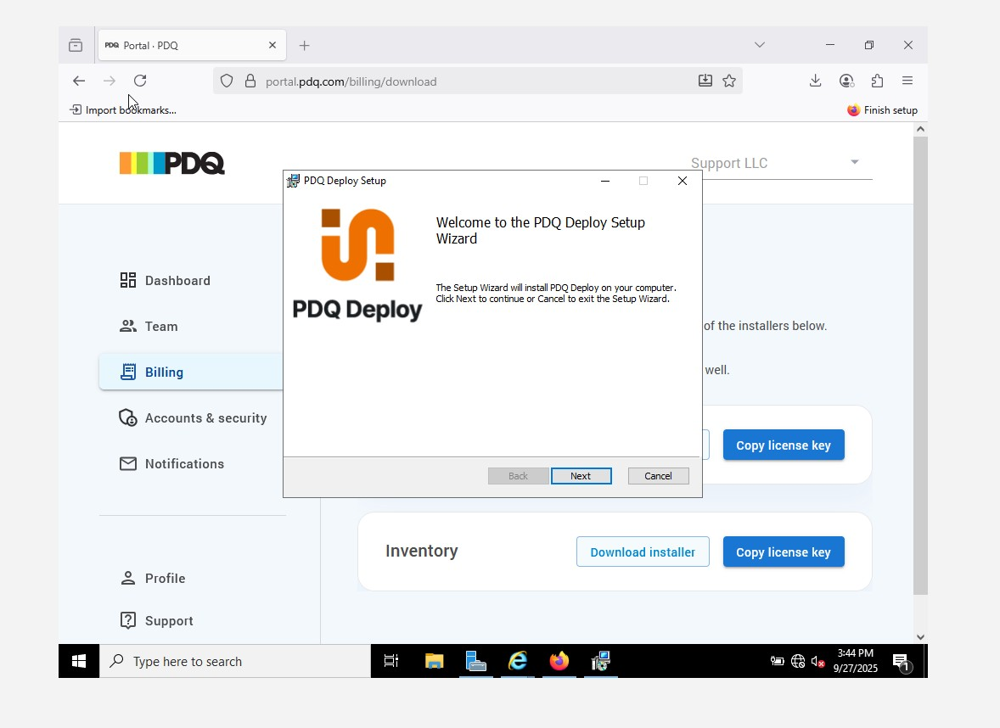
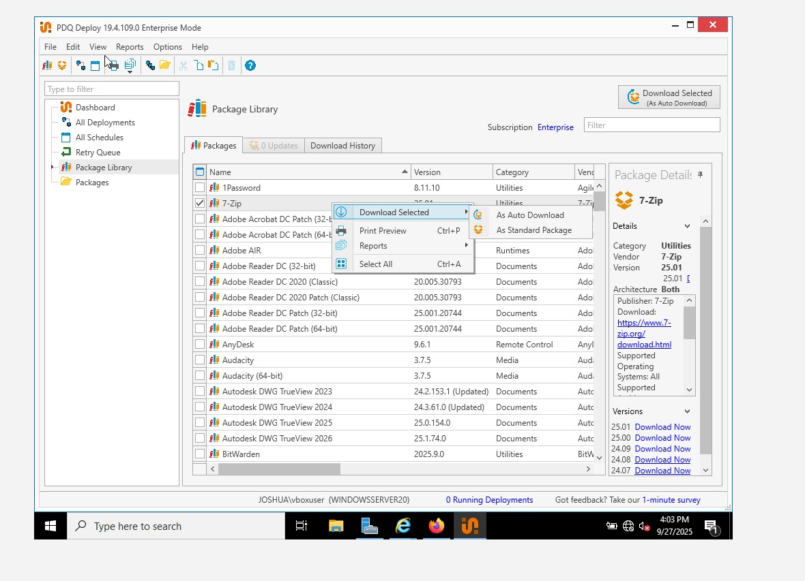
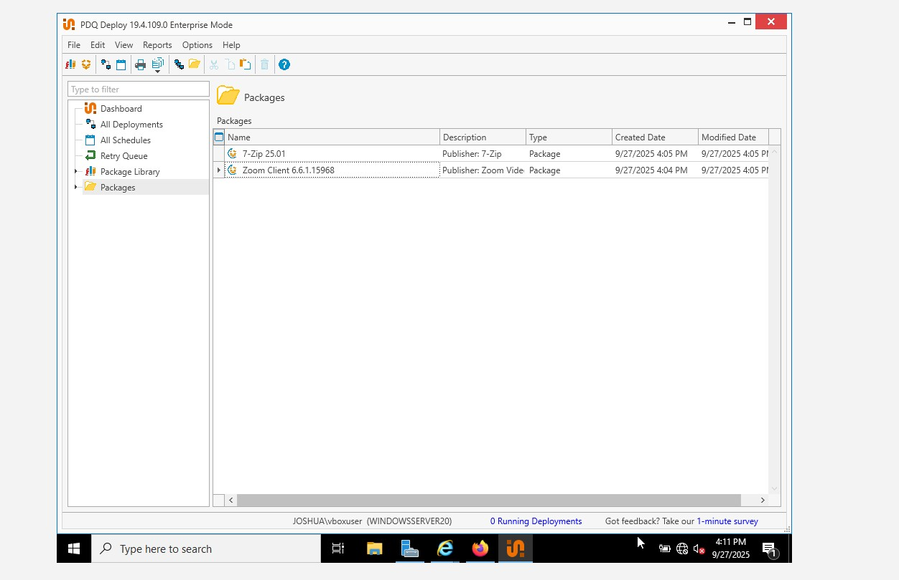

# PBQ Deploy

## What is PDQ Deploy?

PDQ Deploy is a remote software deployment tool for Windows environments. It allows you to push software, scripts, patches, and updates to multiple machines simultaneously or on a schedule.

You can see it as your "remote software installer."
Instead of going from PC to PC, you send out one command and PDQ takes care of the rest.
As a  Helpdesk I might approval from management to install software application to client machine silently without interrupting their work.

---
## What Does It Do?

- Silently installs applications (e.g. Chrome, Zoom, Adobe Reader)
- Updates software and deploys custom scripts
- Schedules deployments (e.g install at night)
---
## Setting up PDQ Deploy on Server 2022 (My Lab Environment)

- My Windows Server 2022 has a static IP.
  In order to download PDQ, I had to change it to a dynamic IP address.

### Steps:
1. Navigate to **Control Panel** → **Network** → **Change Adapter Settings**
2. Go to PDQ official website
3.  Sign up for 14-day trial
4.  Fill in my details and verify my email account
5. Download PDQ Deploy and input the license key

## PDQ Dashboard Overview

- The Dashboard shows:
 - All Deployments
 - All apps deployment to endpoints
 - All schedules
 - Retry queue
 - Package Library

### Package Library
- This is where all the apps are located
---
## Deploying Application on Server 2022

- Go to **Package Library**
- Select the app (in my lab: Zoom
- Right-click the app → Select **Download Selected**
- As app downloads, it gets added to local library

1. Go to **Package**
2. Select the app package
3. Right-click → Select **Deploy Once**

4. On the top right, click on **Targets**
5. Select **Active Directory** → **Computers**
