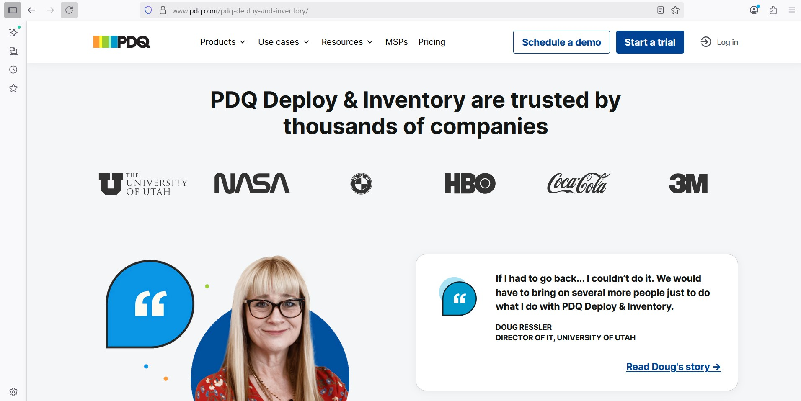

## PDQ Inventory

### What is PQD Inventory?
PDQ Inventory is a systems management tool for Windows that helps IT administrators automatically scan, collect, and organize information about computers and devices in their network.
It scans and gathers system information from all computers on the network (CPU, RAM, indtalled apps, OS Version, etc)

### Computer Scanning & Data Collection
PDQ Inventory scans each machine to gather details such as:
- Hardware (CPU, RAM, disk space, etc.)
- Installed software and versions
- Operating system and patch levels
- Services, running processes, users, and event logs

### Centralized DataBase
- All the collected information is stored in a searchable database.
- Admins can group computers dynamically (for example, “all machines missing a specific update” or “all computers running Windows 10”).

### Integration with PDQ Deploy
- PDQ Inventory works closely with PDQ Deploy.
 For example:
   - You can create a group in Inventory for “computers missing Adobe Reader” and then use PDQ Deploy to push the Adobe Reader update only to those machines.

### Installing PDQ Inventory
- Download PDQ Inventory and copy license key.
- Launch the application → Accept terms → Next → Install
- 
- Enter license key and email account → Select **Local**
- Choose installation type  → Enter credential password  → Finish
![Screenshot] 
### Launch PDQ Inventory
  
  PDQ Inventory gives you a run-down of everything installed on a computer: apps, updates, etc.
  In my project, I have Windows 11 added to the PDQ Inventory.

 ### Adding Computers

 - At the top → **Add Computers** → **Active Directory**
 - It Shows you all the computers on your Active Directory
 
 - Add to the target → Click **OK**
 
---
### Running Reports

- If you right-click on a computer → **Run Report**
- It gives you an in-depth report on:
   - Applications
   - Operating System
   - Shared Folders

