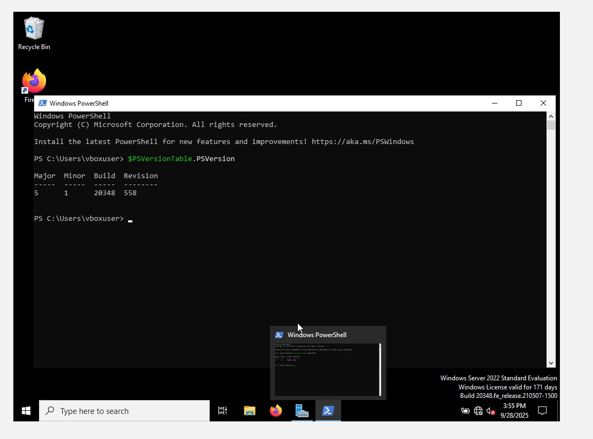

## PowerShell

### What is Powershell?
- A **PowerShell Cmdlet** is a lightweight, single-function command built into PowerShell for performing specific tasks.
- PowerShell is a **command-line shell** and **scripting language** created by Microsoft.
- A **shell** means you can type commands (like `ping`, `ipconfig`) but with more advanced capabilities.
- A **scripting language** means you can write a list of commands in a file (a **script**) so they run automatically instead of typing them one by one. 

### Why Use PowerShell?
- With PowerShell scripting, you can:
  - Perform **Active Directory tasks** → Create, disable, or reset 50 user accounts at once.
  - Handle **Microsoft 365 / Intune tasks** → Assign licenses, reset passwords, configure settings.
  - Run **system checks** → Pull logs, check disk space, list installed software on 100 machines.
  - Enable **automation** → Instead of manually patching machines or running updates, script it once and run it everywhere. # Downloading Powershell 7.4.5

* Go to Microsoft’s official GitHub release page:  
  [https://github.com/powershell/powershell/releases](https://github.com/powershell/powershell/releases)
  → Under **Assets**, download the **.msi installer** for Windows (x64 bit)
  → Example: `powershell-7.4.5-win-x64.msi`
  → Run the installer. ✅  
 
