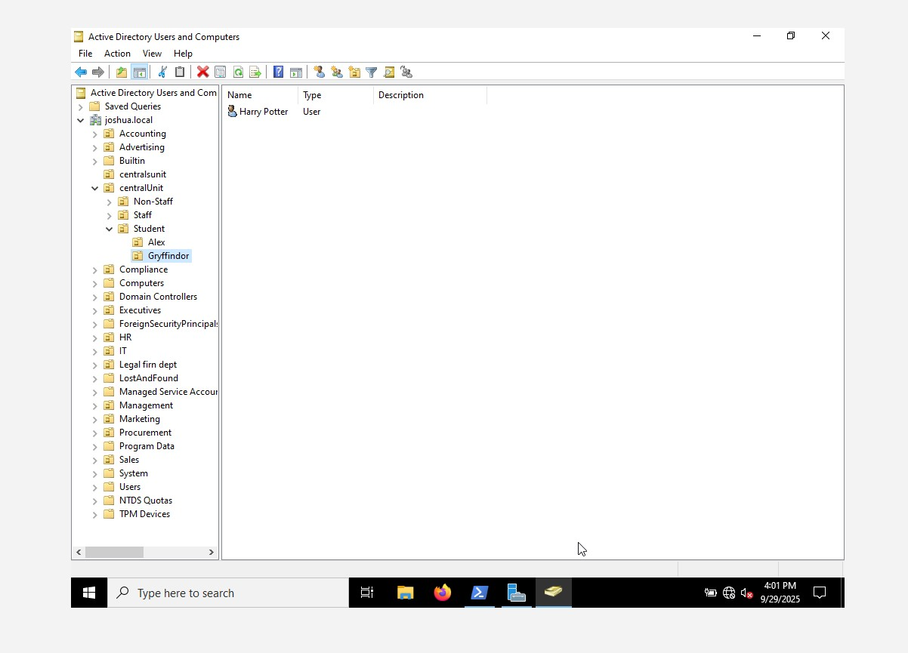

# Powershell Automation (Active Directory)

## Overview
PowerShell Active Directory refers to the use of the Active Directory module for Windows PowerShell to manage and automate tasks in Microsoft Active Directory.  

It uses PowerShell commands (cmdlets) to perform operations such as:
- Creating, modifying, and deleting users and computers  
- Managing groups and organizational units  
- Resetting passwords and unlocking accounts  
- Querying Active Directory for information (e.g., last logon times, group membership)
- Automating bulk changes across multiple objects 
---
## Getting Started
To work with PowerShell in Active Directory, you need to import the module to get the commands for Active Directory automation.  
##  Steps:
1. Navigate to the Start Menu → search for **PowerShell**  
2. Right-click and **Run as Administrator**  
3. In PowerShell, run:
   Import-Module Active Directory

4. Get-Command  (shows Different command to use) to run scripts.

## Creating a New Organizational Unit (OU) with PowerShell  

You can create a new OU in Active Directory using this cmdlet:
  
`New-ADOrganizationalUnit -Name "CentralUnit" -Path "DC=joshua,DC=local"`

- `-Name` specifies the OU name

- `-Path` specifies the domain structure where it will be create


# Creating More OUs with PowerShell

* Creating Sub OUs inside Central Unit with PowerShell
* Created another sub OUs under Student for Gryffindor to add a user inside.


# Using PowerShell, I created a New User account in Active Directory

  Using the Cmdlet:
  

```
```powershell
New-ADUser -Name "Harry Potter" -SamAccountName "hpotter" -UserPrincipalName "hpotter@Njikason.com" -Path "OU=Gryffindor, OU=Student, OU=CentralUnit, DC=Joshua, DC=local" -AccountPassword (ConvertTo-SecureString "Capitolp123" -AsPlainText -Force) -Enabled $true -ChangePasswordAtLogon $true
```
- Created User account (Harry Potter) using the above Script.

- Created another User account (Hermione Granger) using the same script.


---
# Get-ADUser

- `Get-ADUser` is used to retrieve information about a User account in Active Directory (AD) and also properties like email, groups, account information.


---
# Adding Email Address to a User

- Adding email address to the user Harry Potter on PowerShell:
    
`Set-ADUser -Identity "hpotter" -Email "harry.potter@njikason.com" -OfficePhone "800-555-7777"`


---
