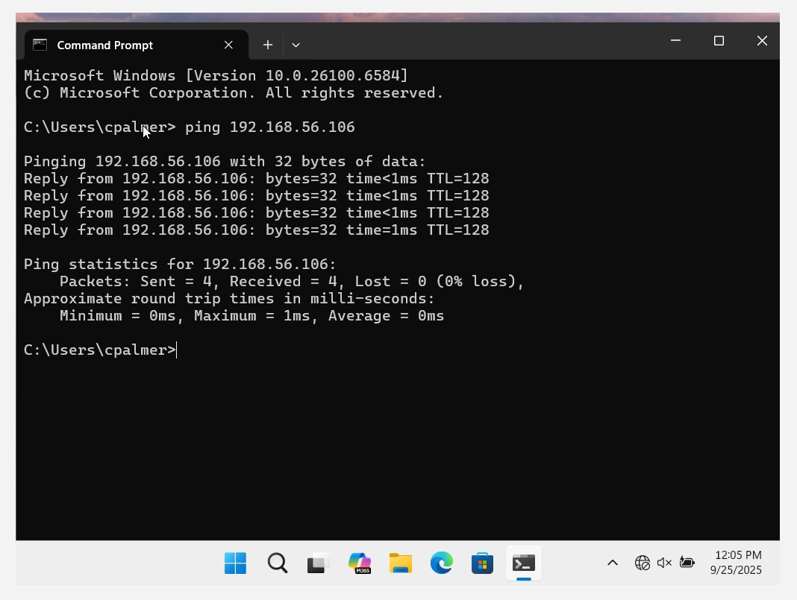
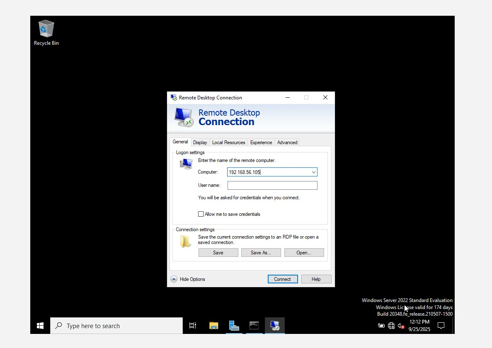
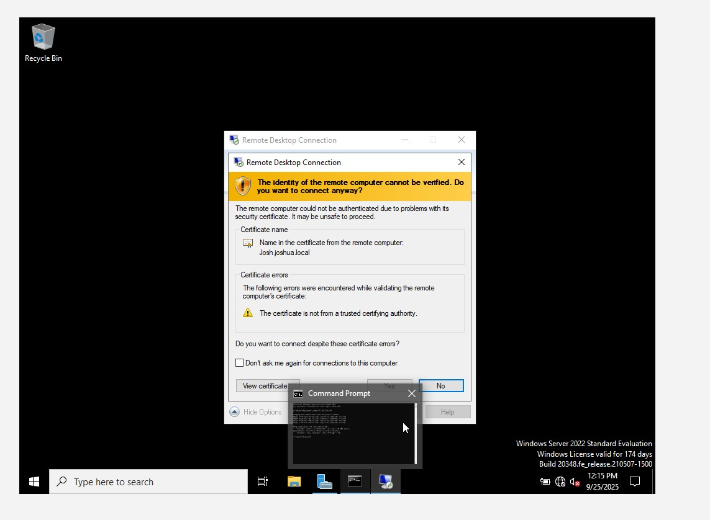

## RDP (Microsoft Remote Desktop Protocol)

### What is RDP?
It’s a proprietary protocol developed by Microsoft that allows a user to connect to another computer over a network and interact with its desktop as if they were sitting right in front of it.

It’s commonly used by IT Support or System Administrators to:
- Troubleshoot issues
- Configure systems  
- Perform administrative tasks  
All without needing physical access to the device.

### Purpose
RDP is mainly used for remote administration, technical support, or accessing work PCs from home.

### Functionality
It transfers the screen display of the remote machine to the client device and sends back the client’s keyboard and mouse input.

### Security
RDP uses encryption to protect sessions, but it can be a security risk if not configured properly (e.g., weak passwords, open ports without firewall/VPN).

### Common Use
IT support teams, system administrators, and employees working remotely often use RDP to manage or access computers and servers.

### Example
If you’re at home and need to access your office computer, you can open the Remote Desktop Connection app, enter your work computer’s IP address or name, and log in with your credentials. Once connected, you see and control your office desktop from your home computer.

---
### Pre-Connection Checklist
- First, make sure both systems can **ping each other** (check network connectivity).
- Confirm they are both **on the same network**.
- Server used: **Server 2022**
- Client machine used: **Windows 11 Pro** (`OS 10.1 - WIn11`)

---
### How to Launch RDP on Windows
1. Press `Win + R`
2. Type `mstsc`
3. Enter the **IP address** or **name** of the user’s computer (e.g., `192.168.56.106`)

4. Then connect:
   - A prompt will appear
   - Click **Yes**
