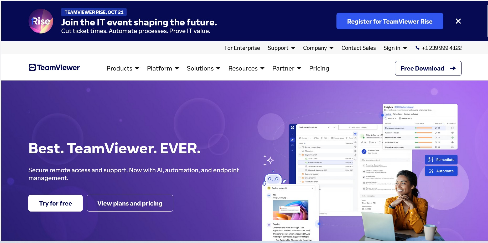
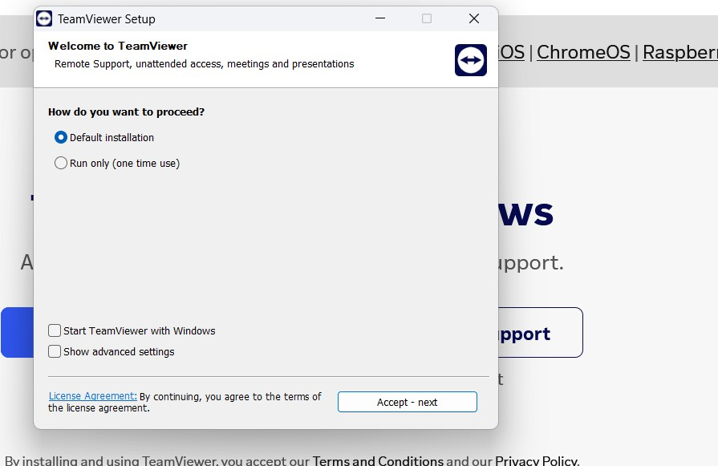
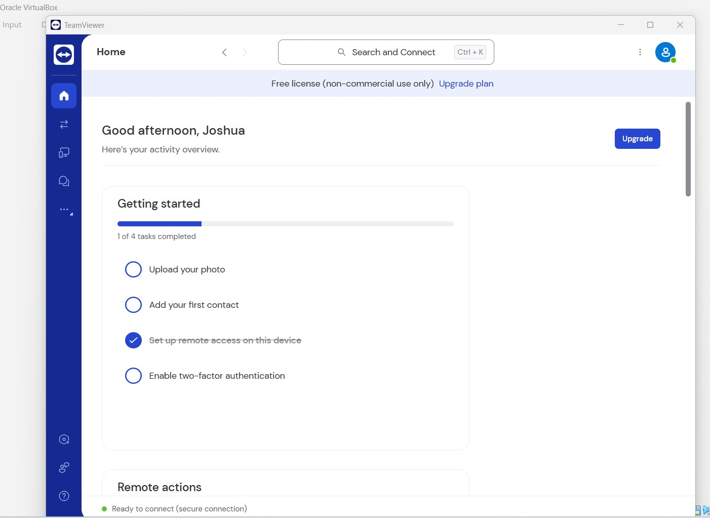
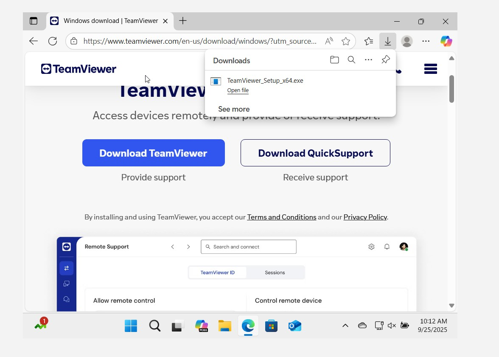

### What is Remote IT Support?

- Is when an IT professional helps users fix technical problems without being physically present, by connecting to their computer or guiding them through troubleshooting steps online.

- Remote IT support is the process where IT professionals connect to a user's computer or system over the internet or network to

  - Troubleshoot issues
  - Install software
  - Configure settings
  - Provide technical assistance without being physically present.
---

### Remote Access Tools
- The technician uses software like TeamViewer, AnyDesk, or RDP (Remote Desktop Protocol) to log into the user’s computer over the internet.

### Communications 
- Support is usually provided via phone, email, chat, or video call while the technician works in the background.

### Services Provided
- Common tasks include installing or updating software, removing viruses, configuring settings, resetting passwords, resolving network issues, and answering technical questions.

### Benefits 
  - Faster Resolution: Issues can be solved immediately without waiting for someone to travel onsite.
  - Cost-Effective: Saves time and money for both the company and the user.
  - Scalable: A single IT team can support users across different cities or even countries.

### Example 
 - If your laptop suddenly can’t connect to Wi-Fi, you might call the IT help desk. Instead of coming to your office, the IT technician could securely log in to your system from their location, diagnose the network settings, fix them, and get you back online.

### Setting up TeamViewer

- Installing TeamViewer (desktop client) on:

  - Host machine
  - Windows 11 (running in Virtual Box)

--- 
### Enabling Remote Desktop on Windows11

1. Go to **This PC**
2. Right-click → **Properties**
3. Scroll down to **Remote Settings**
4. Log in with admin rights

