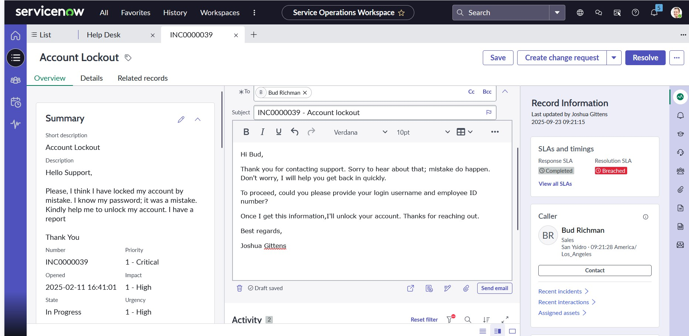
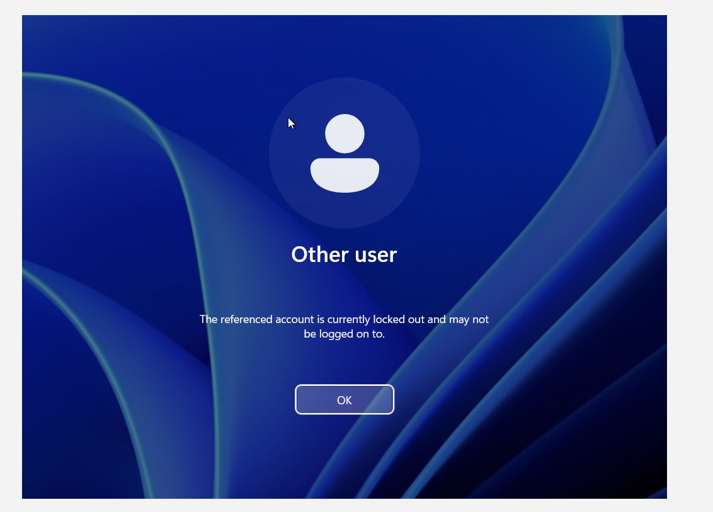
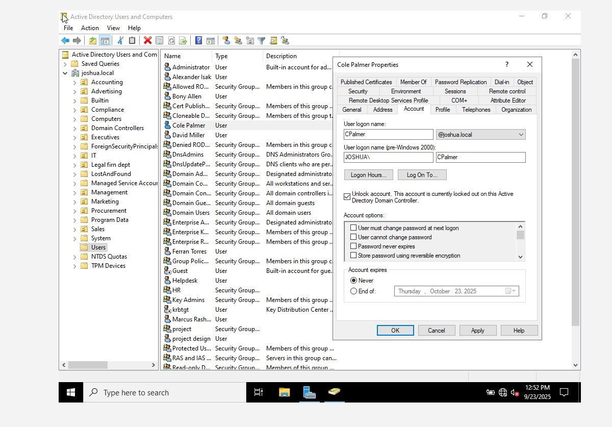
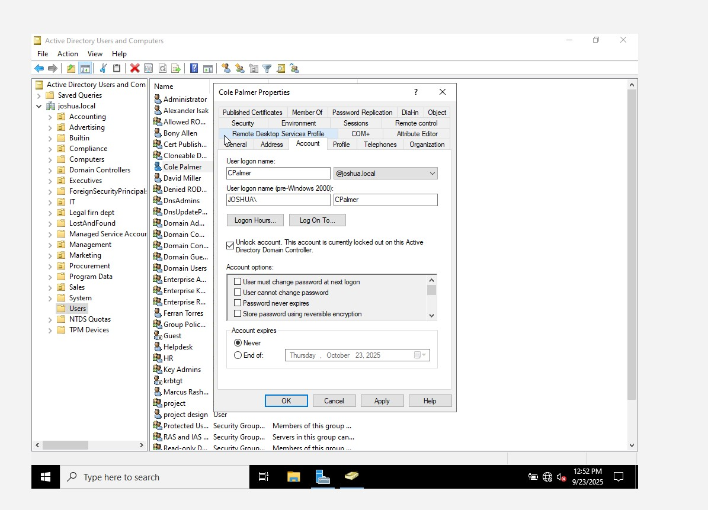
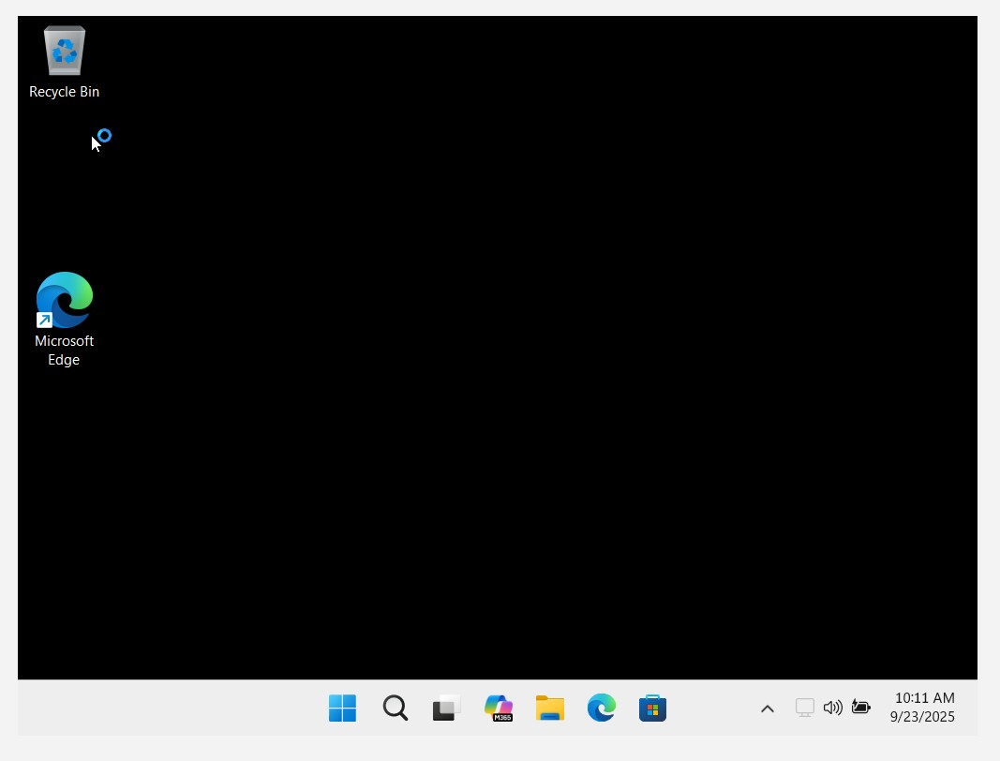
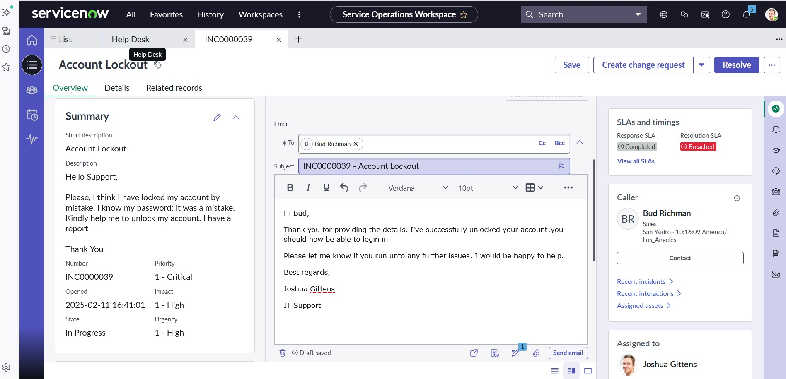
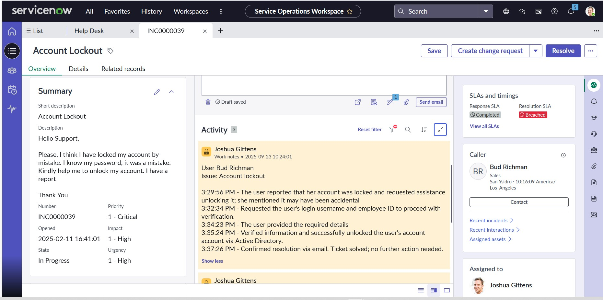

## IT Troubleshooting & Common Issues

- Troubleshooting steps used to solve IT issues, helping users stay productive whether it’s password reset issue, account lock-out, computer doesn’t work.
- Knowing how to troubleshoot is very important and a success factor in any IT career.
---
## Troubleshooting IT Issues

### Locked Account - User Cannot Log In
- User reached out support that account has been locked and can’t log in.

- Receive the ticket, head over to **Active Directory Users & Computers**:
  - Find → Type in user log-in name → Account →  

  - Unlock account: check the box, then apply and OK.

- Confirm: The account has been unlocked.

---
### Password Reset - User Forgot Password
- User needs a password reset and can’t log in.
- Reach out to the user → Verify identity → Ask for user log-in details.
- Navigate to **Active Directory**:
  - Right-click on the domain → Click on *Find*
  - Entire directory → Type the name →

  - Right-click → Reset password → Provide a temporary password
  - Check “User must change password at next logon” → OK.

- User logs in with the new password after changing it.

